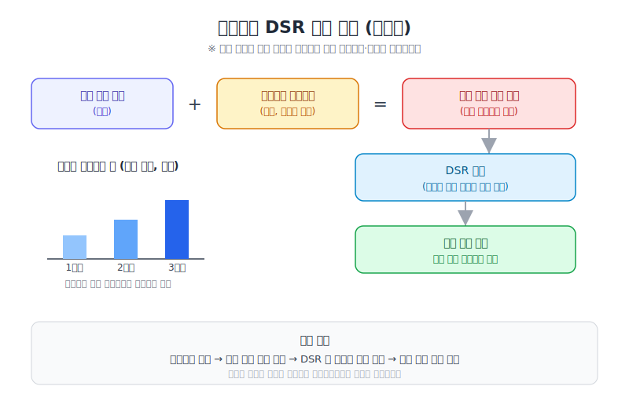
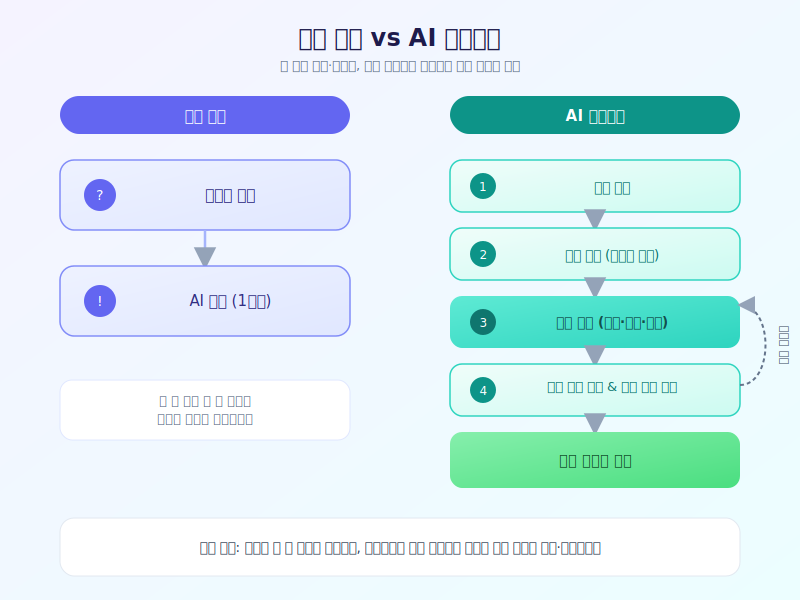

# 일 잘하는 사람들은 이미 쓰고 있다는 AI 에이전트, 뭐가 다를까

  

최근 업무 현장에서 자주 들리는 단어 중 하나가 바로 'AI 에이전트'입니다. 단순히 질문에 답하는 챗봇을 넘어, 여러 단계의 작업을 스스로 계획하고 실행까지 해내는 도구들이 하나둘 실무에 자리 잡으면서, 이제는 소수의 얼리어답터만이 아니라 평범한 직장인들도 관심을 갖는 주제가 됐습니다. 오늘은 AI 에이전트가 기존 챗봇과 무엇이 다른지, 실제로 어떻게 활용되고 있는지 정리해보겠습니다.

기존의 챗봇형 AI는 사용자가 질문을 던지면 그에 맞는 답을 한 번에 내놓는 방식이었습니다. 반면 AI 에이전트는 하나의 목표가 주어지면 이를 여러 개의 작은 작업으로 쪼개고, 필요할 경우 검색이나 문서 작성, 코드 실행 같은 외부 도구까지 스스로 활용해 순차적으로 처리해 나갑니다. 사람이 매 단계마다 지시를 내리지 않아도 중간 결과를 확인하며 다음 행동을 알아서 결정한다는 점이 가장 큰 차이입니다.

  

실제 현장에서는 반복적이고 시간이 오래 걸리는 업무에서 AI 에이전트의 활용도가 두드러집니다. 고객 문의 응대 초안 작성, 방대한 자료 요약과 정리, 반복되는 데이터 입력이나 보고서 초안 작성 같은 업무에 에이전트를 붙여두고, 사람은 최종 검토와 판단에만 집중하는 방식이 늘고 있습니다. 다만 아직은 완전히 손을 놓아도 되는 단계는 아니라서, 결과물을 검증하는 절차와 명확한 권한 범위를 함께 설계하는 것이 중요하다는 지적도 나옵니다.

AI 에이전트 도입을 고민하고 있다면, 처음부터 거창한 자동화를 목표로 삼기보다 반복적이고 규칙이 뚜렷한 업무 하나를 골라 작게 시작해보는 것을 추천합니다. 작업 범위를 좁게 잡고 결과를 사람이 검토하는 구조로 운영하다 보면, 어느 업무에 얼마나 믿고 맡길 수 있는지 감을 잡을 수 있습니다. 도구는 이미 충분히 준비돼 있는 만큼, 이제는 우리 업무 방식을 어떻게 재설계할지가 관건인 시점입니다.

※ 이 초안은 AI가 생성했습니다. 게시 전 수치·정책 내용의 사실관계를 반드시 확인하세요.
