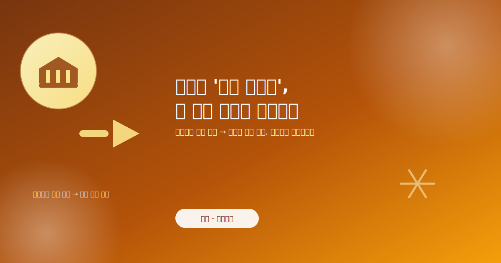
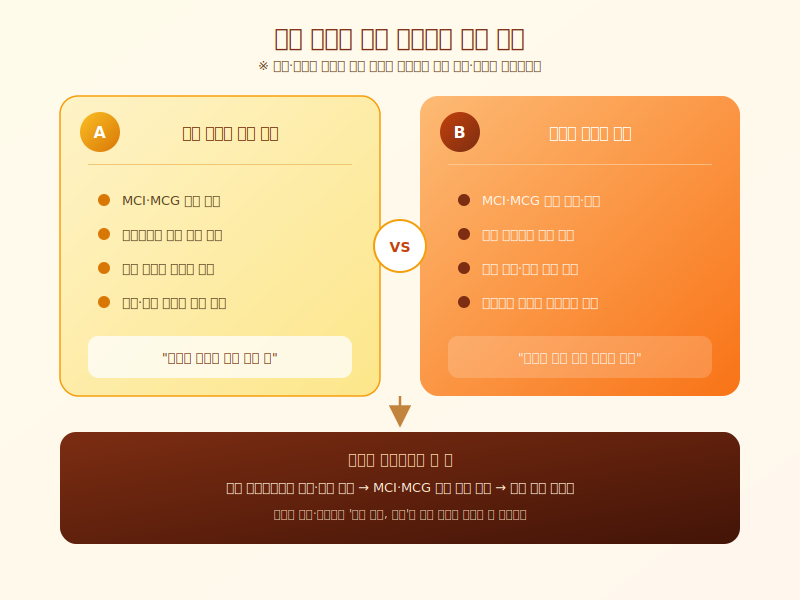

# 하반기 '대출 빙하기' 온다는데, 내 대출 한도는 괜찮을까

  

최근 은행권에서 '대출 빙하기'라는 말이 심심치 않게 들립니다. 가계대출 총량이 관리 한도의 상당 부분까지 채워지면서, 주요 은행들이 주택담보대출 취급을 조이는 움직임을 잇달아 보이고 있기 때문입니다. 대출을 계획하고 있던 분이라면 "지금 신청해도 괜찮을까"라는 걱정이 들 수밖에 없는 시점입니다. 오늘은 하반기 대출 시장이 왜 이렇게 얼어붙고 있는지, 그리고 실수요자 입장에서 무엇을 챙겨야 하는지 정리해보겠습니다.

가계대출 총량 관리는 은행이 한 해 동안 늘릴 수 있는 대출 규모에 사실상 상한선을 두는 방식입니다. 총량이 한도에 가까워질수록 은행 입장에서는 신규 취급을 줄이거나 심사를 더 까다롭게 할 유인이 커집니다. 특히 주택담보대출 한도를 늘려주는 핵심 수단으로 쓰이던 모기지신용보험(MCI)·모기지신용보증(MCG) 취급을 제한하는 은행이 늘면서, 같은 집을 담보로 잡아도 예전만큼 한도가 나오지 않는 경우가 많아지고 있습니다. 결과적으로 대출 창구 자체가 좁아지는 셈입니다.

  

이런 흐름은 은행마다, 또 시기마다 다르게 나타날 수 있다는 점도 알아둘 필요가 있습니다. 총량 여력이 상대적으로 남아 있는 은행과 이미 한도에 근접한 은행 사이에 실제 승인 가능성과 한도 차이가 벌어질 수 있고, 분기나 반기 초반에는 다소 여유가 있다가 하반기로 갈수록 문턱이 높아지는 패턴이 반복되어 왔습니다. 즉 같은 조건이라도 '언제, 어느 은행에서' 신청하느냐에 따라 결과가 달라질 수 있다는 뜻입니다.

대출을 앞두고 있다면 한 곳의 결과만 보고 판단하기보다, 여러 금융기관에서 한도와 조건을 미리 비교해보는 것이 현실적인 대응이 됩니다. MCI·MCG 취급 여부, 상품별 가산금리, 상환 방식에 따라 실제 받을 수 있는 금액이 꽤 달라질 수 있기 때문입니다. 또한 총량 관리는 시기에 따라 다시 조정될 수 있는 정책 변수인 만큼, 자금 계획에 여유가 있다면 시장 상황을 조금 더 지켜보는 것도 하나의 선택지가 될 수 있습니다. 내 집 마련이나 자금 조달을 앞두고 계시다면, 지금 시점의 대출 환경을 정확히 파악한 뒤 움직이시길 권합니다.

※ 이 초안은 AI가 생성했습니다. 게시 전 수치·정책 내용의 사실관계를 반드시 확인하세요.
