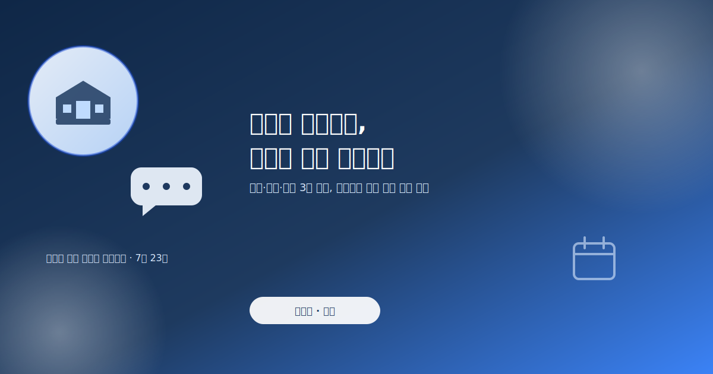
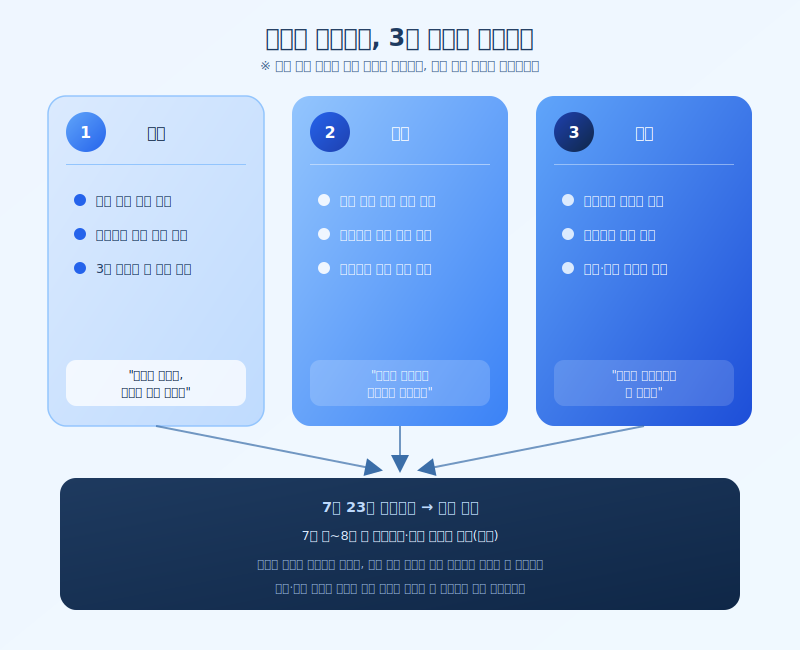

# 이재명 대통령 부동산 대토론회, 이번엔 뭐가 달라질까

  

최근 정부가 이재명 대통령이 직접 주재하는 부동산 정책 대토론회를 예고하면서, 부동산 시장에 대한 관심이 다시 뜨거워지고 있습니다. 지난 1년 사이 서울을 중심으로 집값과 전월세 가격이 크게 오른 상황에서 열리는 자리인 만큼, 이번 토론회에서 어떤 방향이 제시될지에 이목이 쏠립니다. 동시에 정부는 이달 말에서 다음 달 초 사이 부동산 종합대책과 세제 개편안을 발표할 예정이어서, 이번 대토론회는 사실상 그 밑그림을 가늠해볼 수 있는 자리로 여겨지고 있습니다.

이번 논의의 배경에는 최근 1년간 이어진 집값 상승에 대한 우려가 자리하고 있습니다. 매매가와 전월세 가격이 모두 상당폭 올랐다는 지적이 나오면서 규제 강화 필요성에 대한 목소리도 커진 상황입니다. 이런 흐름 속에서 정부가 준비 중인 종합대책은 크게 공급 확대, 금융 규제, 세제 개편이라는 세 갈래로 논의될 것으로 전망됩니다. 공급 측면에서는 신규 택지와 정비사업 추진 속도가, 금융 측면에서는 이미 시행 중인 대출 규제의 추가 조정 여부가, 세제 측면에서는 다주택자와 실수요자를 구분하는 기준 조정이 핵심 쟁점으로 거론되고 있습니다.

  

다만 대토론회 자체가 곧바로 확정된 정책을 발표하는 자리는 아니라는 점은 유의할 필요가 있습니다. 여러 이해관계자의 의견을 수렴하는 성격이 강한 만큼, 실제 종합대책에 담길 내용은 토론회 이후 조율 과정을 거치며 달라질 수 있습니다. 그럼에도 어떤 의제가 테이블 위에 오르는지, 어느 방향에 무게가 실리는지를 미리 살펴보는 것은 매수 대기자나 기존 보유자 모두에게 의미가 있습니다. 특히 규제지역 추가 지정이나 대출 한도 조정처럼 이미 진행 중인 변화들이 이번 논의를 계기로 더 강화될 가능성도 배제할 수 없습니다.

부동산 정책은 발표 시점과 세부 기준에 따라 개인이 받는 영향이 크게 달라지는 영역입니다. 이번 대토론회와 뒤이은 종합대책 발표 일정을 챙겨보면서, 본인이 해당되는 지역과 조건에 어떤 변화가 생기는지 미리 점검해두는 것이 좋습니다. 특히 실거주 목적의 매수나 갈아타기를 계획하고 있다면, 아직 확정되지 않은 논의 단계의 이야기에 성급하게 반응하기보다 공식 발표 내용을 차분히 확인한 뒤 움직이시길 권합니다.

※ 이 초안은 AI가 생성했습니다. 게시 전 수치·정책 내용의 사실관계를 반드시 확인하세요.
