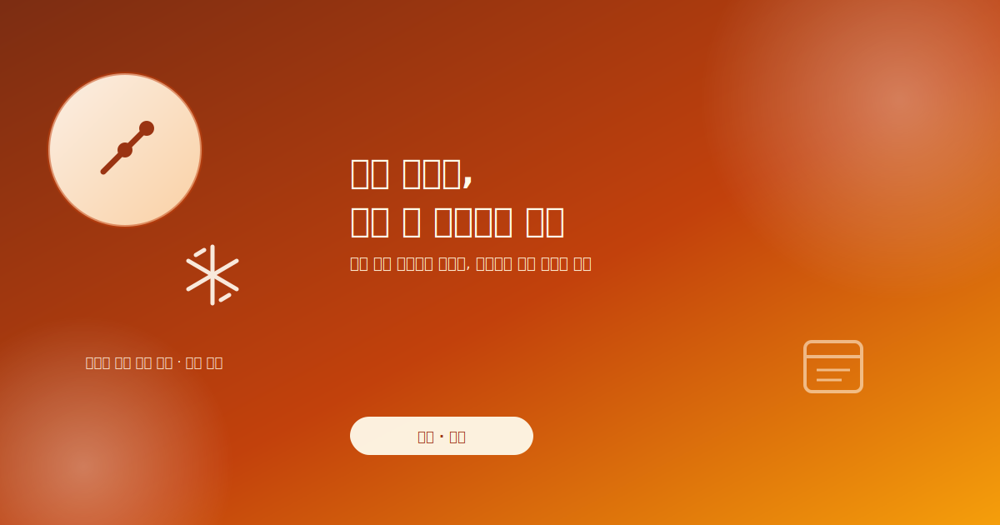
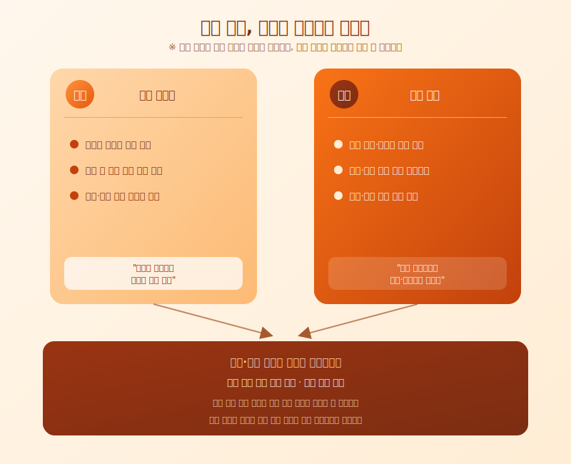

# 은행권 '대출 빙하기' 본격화, 실수요자는 무엇을 준비해야 하나

  

최근 며칠 사이 시중은행들이 잇달아 주택담보대출 한도를 줄이고, 관련 보증·보험 취급을 조이면서 '대출 빙하기'라는 표현까지 나오고 있습니다. 잔금을 앞두고 있거나 곧 이사 계획이 있는 분들이라면 이런 흐름을 남 일처럼 넘기기 어려운 시점입니다. 불과 얼마 전까지만 해도 가능했던 대출 조건이 지금은 은행마다, 지점마다 다르게 적용되는 경우가 늘면서 혼란도 커지고 있습니다.

이런 조치가 나오는 배경에는 가계부채를 관리하겠다는 정부와 금융당국의 기조가 자리하고 있습니다. 시중에 풀리는 대출 규모 자체를 조절하려는 목적인 만큼, 특정 상품 하나를 손보는 수준이 아니라 한도 산정 방식이나 심사 기준 전반에 걸쳐 변화가 나타나고 있는 것으로 보입니다. 문제는 이런 변화가 은행별로, 또 시점별로 속도가 다르게 적용되고 있어 같은 조건이라도 어느 은행에서 언제 신청하느냐에 따라 실제로 받을 수 있는 금액이 달라질 수 있다는 점입니다. 여기에 대출과 함께 검토되는 보증·보험 상품까지 취급 조건이 바뀌면서, 예전에는 크게 신경 쓰지 않았던 부분까지 하나하나 다시 확인해야 하는 상황이 됐습니다.

  

특히 이미 매매 계약을 마치고 잔금일을 정해둔 상태라면 상황이 더 급박하게 느껴질 수 있습니다. 계약 당시 예상했던 대출 한도가 실제 실행 시점에는 줄어들 수 있기 때문에, 자금 계획에 여유를 두지 않았다면 잔금 마련에 차질이 생길 위험이 있습니다. 이런 시기일수록 한 곳의 안내만 믿기보다 여러 은행의 조건을 함께 확인하고, 필요하다면 잔금일 조정이나 추가 자금 조달 방안까지 미리 열어두는 편이 안전합니다.

대출 환경은 지금처럼 짧은 기간 안에도 크게 바뀔 수 있는 영역입니다. 이사나 매매를 앞두고 있다면 최신 한도와 심사 기준을 은행 창구나 공식 공지를 통해 직접 확인하고, 예상보다 한도가 줄어드는 경우를 가정한 여유 자금 계획을 함께 세워두시길 권합니다. 시장 상황은 앞으로도 계속 바뀔 수 있는 만큼, 큰 자금이 오가는 결정일수록 성급하게 움직이기보다 최신 정보를 확인한 뒤 진행하는 것이 좋습니다.

※ 이 초안은 AI가 생성했습니다. 게시 전 수치·정책 내용의 사실관계를 반드시 확인하세요.
