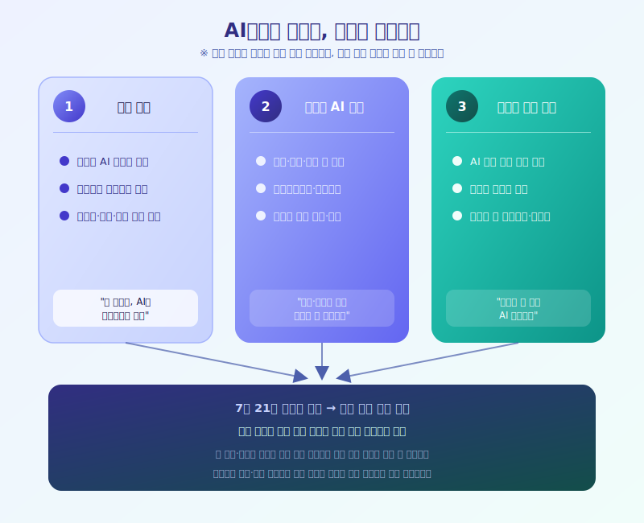

# 오늘부터 시행된 AI기본법, 우리 일상에서 무엇이 달라질까

  

오늘부터 AI기본법 시행령과 관련 하위 고시가 본격적으로 시행되면서, 그동안 다소 막연하게만 느껴지던 'AI 규제'가 실제 산업 현장과 우리가 매일 쓰는 서비스 안으로 들어오기 시작했다. 지난해 법 원안이 시행된 뒤 약 1년의 유예기간을 거쳐 후속 법령까지 갖춰졌고, 오늘을 기점으로 제도가 사실상 전면 가동에 들어간 셈이다.

가장 먼저 체감될 변화는 '표시 의무'다. 생성형 AI로 만든 이미지나 영상, 음성 콘텐츠, 그리고 딥페이크에는 이제 'AI가 만든 결과물'이라는 사실을 표시해야 한다. 지금까지는 어떤 콘텐츠가 사람이 직접 만든 것인지 AI가 만든 것인지 구분하기 어려웠다면, 앞으로는 온라인에서 마주치는 이미지나 영상 한쪽에 작은 표시나 워터마크가 붙는 모습을 더 자주 보게 될 가능성이 크다.

  

두 번째 변화는 '고영향 AI' 관리다. 의료, 에너지, 교통, 교육처럼 사람의 생명이나 기본권에 큰 영향을 줄 수 있는 분야에서 쓰이는 AI는 고영향 AI로 분류돼 위험관리체계 구축, 사전 영향평가, 사람에 의한 관리·감독 같은 더 엄격한 절차를 거쳐야 한다. 이런 AI를 활용하는 기업 입장에서는 관련 문서를 준비하고 보관해야 하는 부담이 새로 생기는 셈이다.

일부 기업은 지난 유예기간 동안 미리 준비를 마쳤다고 하지만, 세부 기준이나 해석을 둘러싼 현장의 혼란은 당분간 이어질 것으로 보인다. 의무를 지키지 않으면 시정명령이나 과태료 같은 제재로 이어질 수 있다는 점도 기업들이 신경 쓰는 대목이다. 이용자 입장에서도 이제부터는 콘텐츠에 붙은 AI 생성 표시를 한 번 더 확인하는 습관이 필요해질 것 같다.

제도 시행 초기에는 크고 작은 시행착오가 불가피하겠지만, 장기적으로는 AI 서비스에 대한 신뢰를 높이는 방향으로 자리 잡을 가능성이 있다. 앞으로 실제 적용 사례가 쌓이면서 표시 방식이나 고영향 AI의 범위 같은 세부 기준이 어떻게 다듬어질지 계속 지켜볼 필요가 있다.

※ 이 초안은 AI가 생성했습니다. 게시 전 수치·정책 내용의 사실관계를 반드시 확인하세요.
