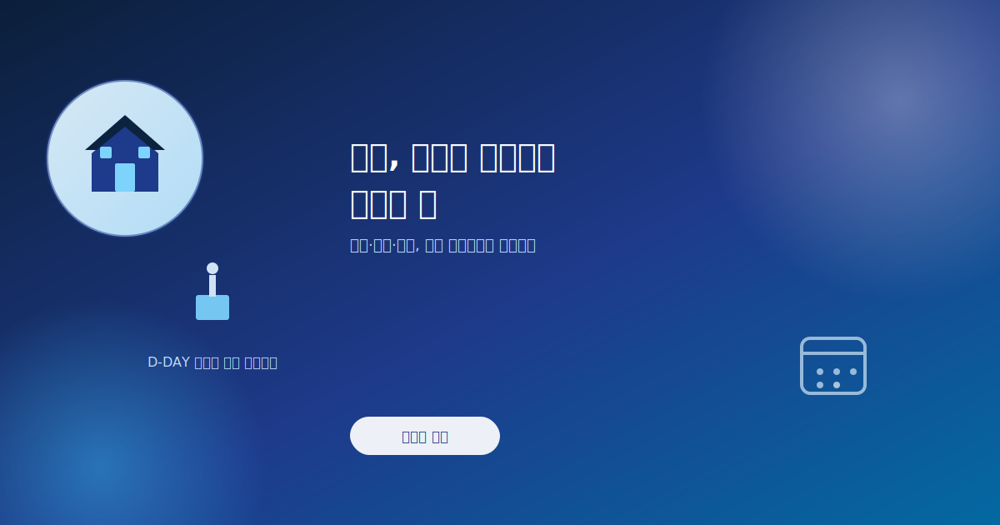
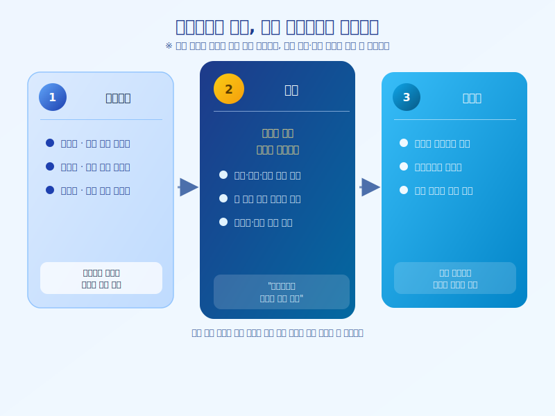

# 오늘, 부동산 대토론회가 열리는 날

  

오늘(7월 23일), 대통령이 직접 주재하는 부동산 대토론회가 열린다. 그동안 국토교통부는 공급 확대 방안을, 금융위원회는 대출·금융 규제를, 기획재정부는 세제 개편 방향을 주제로 각각 부처별 토론회를 이어왔고, 오늘은 그 논의들이 한자리에 모이는 자리다. 예고됐던 일정이 실제로 진행되는 날인 만큼, 무엇이 논의되고 어떤 방향으로 정리될지 관심이 쏠린다.

부처별 토론회에서 다뤄진 쟁점은 저마다 결이 달랐다. 공급 쪽에서는 신규 택지 확보와 재건축·재개발 속도 조절이 핵심 화두였고, 금융 쪽에서는 가계대출 관리와 실수요자 보호 사이의 균형이 쟁점이었다. 세제 쪽에서는 다주택자와 1주택 실수요자를 어떻게 구분해서 다룰지를 두고 여러 의견이 오간 것으로 알려진다. 이 세 갈래 논의가 오늘 자리에서 하나의 방향으로 정리될 수 있을지가 관전 포인트다.

  

다만 대토론회 하루 만에 구체적인 수치나 확정된 정책이 곧바로 나오기보다는, 큰 방향성과 원칙을 제시하는 자리가 될 가능성이 크다는 관측도 있다. 실제 종합대책과 세제개편안은 이후 별도 발표를 통해 구체화될 것으로 예상된다. 그런 만큼 오늘은 '무엇이 확정됐는지'보다 '어느 방향으로 가려는지'를 읽는 자리로 보는 편이 현실적이다.

매수나 보유 계획이 있는 실수요자라면, 오늘 나온 내용을 접하더라도 성급하게 움직이기보다 이후 이어질 세제개편안과 시행 세부안까지 확인하고 판단하는 편이 안전하다. 방향이 잡히더라도 실제 적용 시점과 세부 조건은 다르게 발표될 수 있는 만큼, 오늘의 헤드라인보다 후속 발표를 차분히 따라가는 자세가 필요하다.

※ 이 초안은 AI가 생성했습니다. 게시 전 수치·정책 내용의 사실관계를 반드시 확인하세요.
