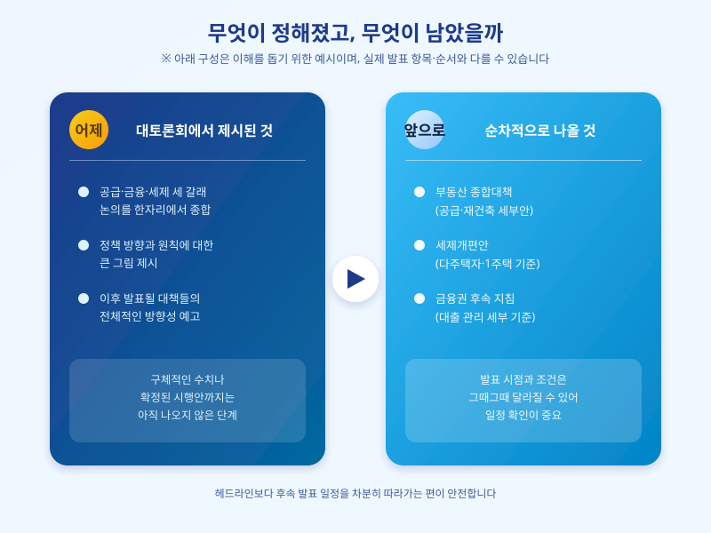

# 대토론회 다음 날, 시장이 주목하는 것

  

어제(7월 23일) 대통령이 직접 주재한 부동산 대토론회가 마무리됐다. 하지만 하루 사이 모든 것이 결론 난 것은 아니다. 대토론회는 공급·금융·세제 세 갈래 논의가 한자리에 모이는 자리였을 뿐, 실제 시장에 적용될 구체적인 내용은 이제부터 하나씩 정리되어 나올 것으로 보인다. 그래서 정작 중요한 관심사는 어제가 아니라 오늘, 그리고 앞으로 이어질 며칠이라는 시각이 많다.

시장과 실수요자들이 가장 먼저 확인하고 싶어 하는 것은 후속 절차의 일정이다. 공급 쪽에서는 어제 나온 방향성이 구체적인 택지·재건축 계획으로 이어질지, 금융 쪽에서는 가계대출 관리 기조가 어떤 형태로 세부화될지, 세제 쪽에서는 다주택자와 1주택 실수요자를 가르는 기준이 어떻게 정리될지가 관전 포인트다. 세 갈래 모두 대토론회 하루 만에 확정안이 나오기보다는, 별도의 종합대책과 세제개편안 발표를 거쳐 구체화되는 순서를 밟을 가능성이 크다.

  

이런 구조를 알고 나면, 대토론회 다음 날 나오는 여러 보도와 해석들을 좀 더 차분하게 볼 수 있다. 방향이 제시됐다고 해서 곧바로 시행 세부안까지 나온 것은 아니며, 실제 적용 시점이나 조건은 이후 발표에서 달라질 수 있다. 헤드라인만 보고 성급하게 움직이기보다, 후속 발표가 언제 어떤 형태로 나올지를 확인하는 편이 안전하다.

매수나 보유 계획이 있는 실수요자라면 지금은 결정을 서두르기보다 정보를 모으는 시기로 삼는 것이 낫다. 종합대책과 세제개편안이 순차적으로 공개될 예정인 만큼, 그 일정을 하나씩 체크해두고 자신의 상황(주택 수, 자금 계획, 대출 여력)에 맞춰 어떤 조항이 실질적으로 영향을 주는지를 그때그때 따져보는 것이 실수 없는 접근이다. 대토론회는 끝났지만, 이야기는 이제 다음 장으로 넘어갔을 뿐이다.

※ 이 초안은 AI가 생성했습니다. 게시 전 수치·정책 내용의 사실관계를 반드시 확인하세요.
