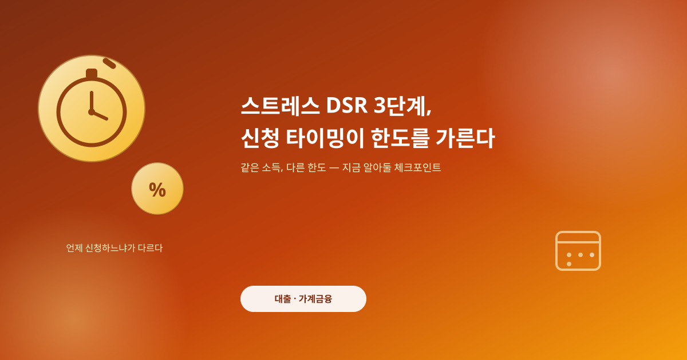
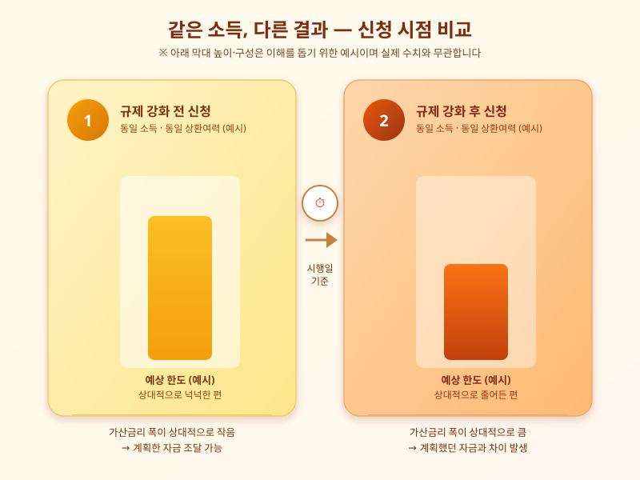

# 스트레스 DSR 3단계, 신청 타이밍이 대출 한도를 가른다

  

집을 살 때 대출 한도를 미리 계산해 자금 계획을 세워뒀는데, 정작 신청 시점이 몇 달 늦어졌다는 이유만으로 받을 수 있는 금액이 크게 줄어드는 경우가 있다. 최근 대출 실수요자들 사이에서 나오는 이야기가 바로 이것이다. 스트레스 DSR 규제가 단계적으로 강화되어 온 탓에, 같은 소득과 같은 집을 두고도 언제 대출을 신청하느냐에 따라 실제로 손에 쥐는 한도가 달라지는 상황이 벌어지고 있다.

스트레스 DSR은 앞으로 금리가 오를 가능성을 미리 반영해, 실제 적용 금리보다 높은 가상의 금리로 원리금 상환 부담을 계산하는 제도다. 이 가산 폭이 단계적으로 확대되어 오면서, 규제가 강화되는 시점을 넘기느냐 넘기지 않느냐에 따라 같은 조건의 차주라도 승인되는 한도가 크게 갈리게 됐다. 문제는 이 시점이 개인의 사정과는 무관하게 정해진다는 점이다. 이사 일정, 잔금 지급일, 계약 갱신 시점처럼 차주 입장에서 조율하기 어려운 변수들과 규제 시행 시점이 맞물리면서, "몇 달만 빨랐어도" 혹은 "조금만 늦었어도"라는 아쉬움 섞인 이야기가 이어지고 있다.

  

이런 흐름 속에서 실수요자가 할 수 있는 대응은 크게 두 가지다. 하나는 대출을 계획하고 있다면 규제 변경 일정을 미리 확인해, 시행 전후로 한도가 어떻게 달라지는지 금융기관을 통해 사전에 시뮬레이션해보는 것이다. 시행 시점을 전후로 신청 여부를 조율할 수 있다면 그 자체로 실질적인 차이를 만들 수 있다. 다른 하나는 애초에 규제 변화를 전제로 자금 계획을 넉넉하게 잡아두는 것이다. 한도가 언제든 줄어들 수 있다는 가정 아래 계획을 세워두면, 예상치 못한 축소에도 크게 흔들리지 않을 수 있다.

결국 지금의 대출 시장에서는 상환 능력만큼이나 '타이밍'이 중요한 변수가 됐다. 같은 상환 여력을 갖고 있어도 신청 시점에 따라 결과가 달라질 수 있다는 점을 이해하고, 금융기관별 시행 일정과 세부 기준을 미리 챙겨보는 습관이 그 어느 때보다 필요한 시점이다.

※ 이 초안은 AI가 생성했습니다. 게시 전 수치·정책 내용의 사실관계를 반드시 확인하세요.
