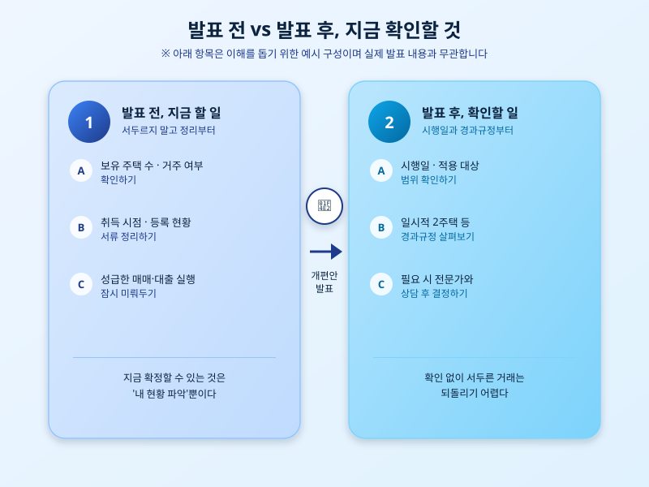

# 세제개편안 발표를 앞두고, 실수요자가 지금 챙겨야 할 체크리스트

  

정부가 예고했던 부동산 세제개편안 발표 시점이 하루하루 다가오고 있다. 그동안 다주택자에 대한 세제 혜택 축소와 실수요자 보호 방향이 여러 차례 언급됐지만, 구체적인 세율과 적용 시점은 아직 확정되지 않은 상태다. 이런 때일수록 발표만 기다리기보다, 지금 내가 처한 상황에서 무엇을 미리 점검해둬야 할지 정리해두는 편이 낫다.

가장 먼저 확인해야 할 것은 내가 어느 쪽에 해당하는지다. 1주택 실수요자인지, 일시적 2주택자인지, 아니면 여러 채를 보유한 다주택자인지에 따라 개편안이 미치는 영향이 크게 달라진다. 특히 일시적 2주택 특례처럼 기존 제도의 유지 여부가 불투명한 항목은, 발표 이후 경과규정이 어떻게 마련되느냐에 따라 희비가 갈릴 수 있다. 지금 보유 중인 주택의 취득 시점, 거주 여부, 등록 현황 같은 서류부터 다시 한번 정리해두는 것이 좋다.

  

두 번째로 챙길 것은 '타이밍'이다. 발표 전에 서둘러 매도나 매수를 결정하기보다는, 개편안의 시행일과 경과규정을 확인한 뒤 움직이는 편이 안전하다. 과거 사례를 보더라도 세제개편은 발표와 동시에 전면 시행되기보다 유예기간이나 단계적 적용을 두는 경우가 많았다. 성급한 판단으로 불리한 시점에 거래를 확정짓는 것보다, 발표 내용을 확인한 뒤 전문가와 상담하며 결정해도 늦지 않다.

세제개편안은 단순한 숫자 조정이 아니라 앞으로 몇 년간 부동산 시장의 방향을 가늠하는 신호가 될 가능성이 크다. 발표 이후 허둥지둥 대응하지 않으려면, 지금 내 보유 현황과 계획을 차분히 점검해두는 것이 가장 확실한 준비다. 발표가 임박한 만큼, 앞으로 며칠간 나오는 소식에 귀 기울이며 대응 방향을 미리 그려두자.

※ 이 초안은 AI가 생성했습니다. 게시 전 수치·정책 내용의 사실관계를 반드시 확인하세요.
