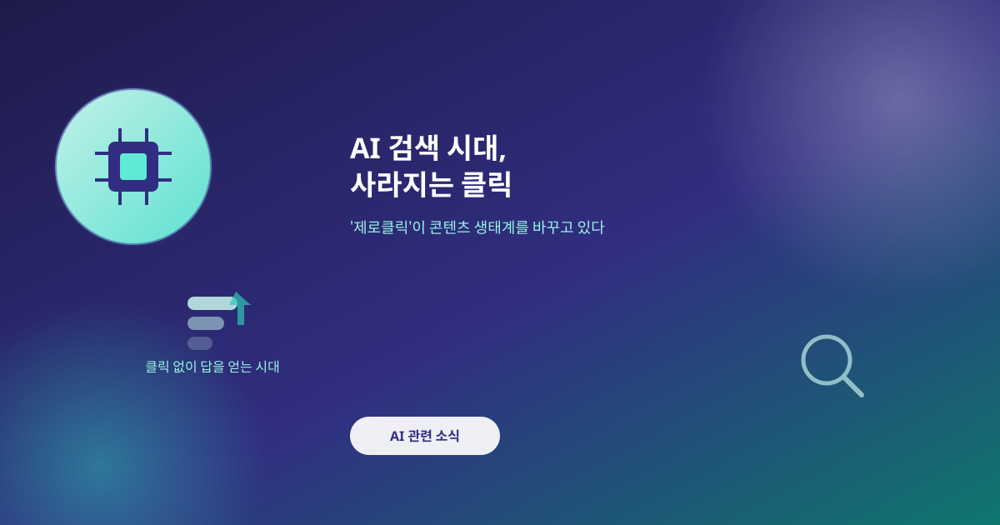
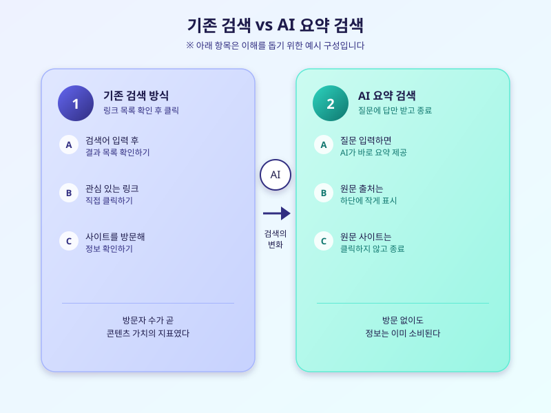

# AI 검색 시대, 사라지는 클릭 - '제로클릭'이 바꾸는 것들

  

요즘 포털이나 AI 검색창에 궁금한 것을 물어보면, 링크 목록 대신 AI가 요약한 답변부터 마주치는 경우가 부쩍 늘었다. 원하는 정보를 얻기 위해 굳이 웹사이트를 클릭할 필요가 없어진 것이다. 이런 흐름을 두고 업계에서는 '제로클릭' 검색이라 부르며, 콘텐츠를 만드는 사람들 사이에서는 반가움보다 불안감이 커지고 있다.

제로클릭 현상이 확산되는 이유는 단순하다. AI가 여러 출처의 정보를 종합해 한 번에 정리해주니, 이용자 입장에서는 굳이 여러 사이트를 옮겨 다니며 정보를 찾을 필요가 줄어든다. 검색 결과 상단에 AI 요약이 자리 잡으면서, 정성껏 작성한 글이 참고 자료로만 소비되고 정작 방문자 수는 늘지 않는 역설적인 상황이 벌어지고 있다.

콘텐츠 제작자와 언론사 입장에서는 이 변화가 남 일이 아니다. 방문자 수가 곧 광고 수익과 직결되는 구조에서, 클릭 없이 정보만 소비되는 흐름은 수익 기반을 흔든다. 일부 매체는 AI 학습과 요약에 자사 콘텐츠가 활용되는 것에 문제를 제기하며 접근을 제한하거나 별도의 계약을 요구하는 사례도 늘고 있다.

  

플랫폼 쪽에서도 이런 우려를 완전히 외면하지는 못하는 분위기다. 출처를 명확히 표기하거나 원문 링크를 더 눈에 띄게 배치하는 등, 콘텐츠 제작자와의 관계를 조정하려는 움직임이 나타나고 있다. 다만 아직은 실험적인 단계에 가까워, 제작자 입장에서 만족할 만한 수준의 보상 구조가 자리 잡았다고 보기는 어렵다.

개인 창작자나 소규모 매체라면 지금부터 방문자 수 하나에만 의존하지 않는 전략을 고민해볼 필요가 있다. 뉴스레터나 커뮤니티처럼 AI 요약이 대체하기 어려운 직접적인 독자와의 관계를 만들어두거나, AI가 인용하고 싶어할 만큼 신뢰도 있고 구체적인 콘텐츠를 꾸준히 쌓아가는 것도 방법이 될 수 있다.

검색이 클릭에서 요약으로 옮겨가는 흐름은 당분간 되돌리기 어려워 보인다. 콘텐츠를 만드는 입장이라면 이 변화를 남 일로 여기기보다, 지금부터 내 콘텐츠와 독자 사이의 관계를 어떻게 다시 설계할지 고민해볼 시점이다.

※ 이 초안은 AI가 생성했습니다. 게시 전 수치·정책 내용의 사실관계를 반드시 확인하세요.
