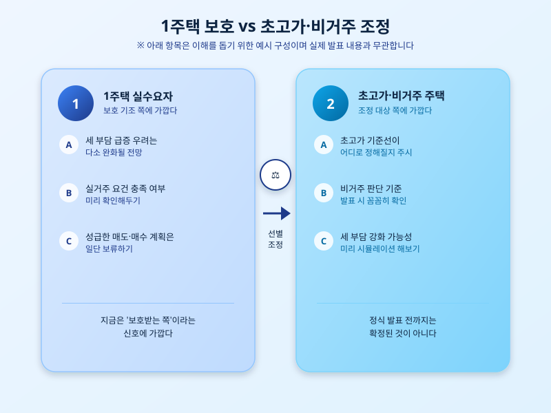

# 부동산 세제개편 밑그림 공개 — '1주택 보호, 초고가 조정'이 뜻하는 것

  

오늘 정부의 부동산 세제개편안 밑그림이 공개되면서 시장의 이목이 쏠리고 있다. 그동안 발표가 임박했다는 이야기만 무성했던 개편안의 방향성이 어느 정도 윤곽을 드러낸 것이다. 핵심은 실거주 목적의 1주택자는 최대한 보호하고, 초고가 주택이나 비거주 목적의 주택은 별도로 관리하겠다는 '선별 조정' 기조다.

이런 방향이 나온 배경에는 투기 수요는 억제하되 실수요자의 부담은 늘리지 않겠다는 정부의 고민이 자리한다. 무주택자나 1주택 실수요자 입장에서는 세 부담이 크게 늘어날 걱정을 다소 덜 수 있는 신호로 읽힌다. 반면 다주택자나 초고가 주택을 보유한 경우라면 앞으로 세 부담이 강화될 가능성에 대비해 미리 셈을 해볼 필요가 있어 보인다.

다만 아직은 '밑그림' 단계라는 점을 놓치면 안 된다. 초고가의 기준선을 어디로 잡을지, 비거주 여부를 어떤 기준으로 판단할지 등 구체적인 수치와 세부 요건은 아직 확정되지 않았다. 정식 개편안이 나오기 전까지는 이번에 공개된 방향성을 참고하되, 세부 내용이 달라질 가능성을 열어두고 지켜보는 편이 안전하다.

  

시장에서는 벌써부터 이번 발표를 두고 다양한 해석이 나온다. 1주택 보호 기조가 확인되면서 실거주 목적의 매수 대기 수요가 조금씩 움직일 수 있다는 관측도 있고, 초고가·다주택 조정이 본격화되면 해당 매물이 시장에 나올 수 있다는 전망도 있다. 다만 세부 기준이 나오기 전까지는 이런 예상들도 어디까지나 추정에 가깝다는 점을 감안해야 한다.

결국 이번 밑그림 공개는 정식 발표를 앞둔 예고편에 가깝다. 실수요자든 다주택자든 지금 단계에서 성급하게 매수·매도를 결정하기보다는, 정식 개편안이 나올 때까지 차분히 세부 내용을 지켜보며 자신의 상황에 맞는 대응 전략을 준비해두는 편이 현명해 보인다.

※ 이 초안은 AI가 생성했습니다. 게시 전 수치·정책 내용의 사실관계를 반드시 확인하세요.
