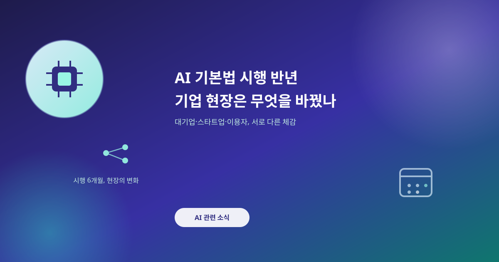
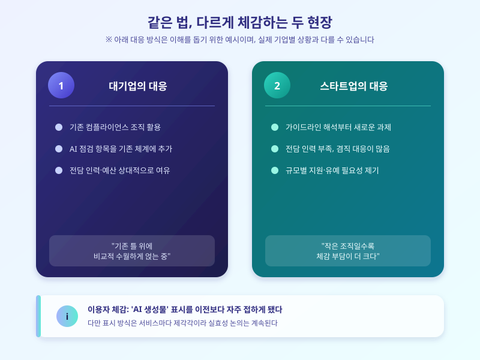

# AI 기본법 시행 반년, 기업 현장은 무엇을 바꿨나

  

올해 초 시행된 국내 AI 기본법이 어느덧 반년을 넘겼다. 시행 초기엔 "규제로 AI 개발이 위축될 것"이라는 우려와 "이제야 최소한의 안전장치가 생겼다"는 기대가 함께 나왔다. 그사이 다양한 AI 서비스가 계속 쏟아져 나온 만큼, 법이 실제 현장에 어떻게 스며들었는지도 함께 따져볼 시점이다. 반년이 지난 지금, 현장의 온도는 어떻게 달라졌을까.

가장 눈에 띄는 변화는 기업들이 AI 서비스를 내놓기 전 거치는 절차가 하나 늘었다는 점이다. 고위험으로 분류될 수 있는 서비스는 위험 요소를 사전 점검하고, 이용자에게 AI가 만든 결과물임을 알려야 한다는 원칙이 조금씩 자리를 잡고 있다. 이를 부담으로 느끼는 곳과 신뢰도를 높이는 계기로 삼는 곳으로 스타트업의 반응은 엇갈린다.

대기업과 스타트업이 체감하는 무게도 다르다. 기존 컴플라이언스 조직이 있는 대기업은 여기에 AI 점검 항목을 얹는 방식으로 비교적 수월하게 대응하지만, 인력이 적은 스타트업은 가이드라인을 해석해 적용하는 과정 자체가 새로운 부담이라는 목소리가 나온다. 규모별 지원이나 유예 기간이 더 필요하다는 지적도 이어진다.

  

이용자 입장에서는 'AI가 만든 콘텐츠'라는 표시를 이전보다 자주 마주하게 됐다는 점이 가장 체감된다. 처음엔 낯설던 이 표시도 이제는 자연스러운 신호로 받아들여지는 분위기다. 다만 서비스마다 표시 방식이 제각각이라 실효성에 의문을 제기하는 시각도 남아 있다.

제도가 자리 잡는 데는 시간이 필요하다. 지금의 반년은 시행 초기 혼란을 정리하고 실무 기준을 다듬어가는 과정으로 보는 편이 맞다. 앞으로 나올 후속 가이드라인과 보완 입법 논의를 지켜보며, 우리가 매일 쓰는 서비스 속에 이 법이 어떻게 스며드는지 계속 눈여겨볼 필요가 있다.

※ 이 초안은 AI가 생성했습니다. 게시 전 수치·정책 내용의 사실관계를 반드시 확인하세요.
