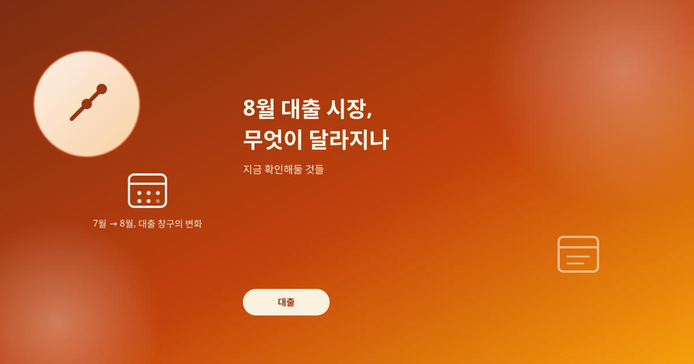
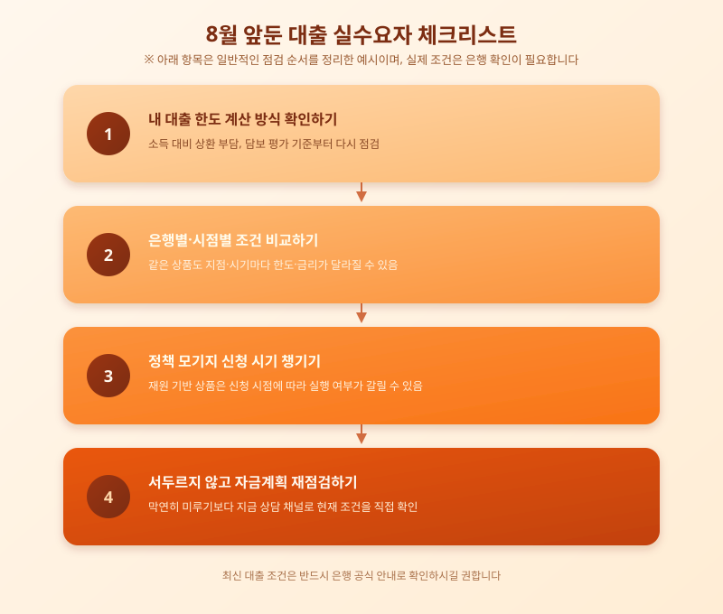

# 8월 대출 시장, 무엇이 달라지나 — 지금 확인해둘 것들

  

7월이 저물고 8월로 넘어가는 이 시점은 은행권 대출 정책이 새 국면을 맞는 때다. 하반기가 무르익을수록 가계부채 관리 강도가 세지는 흐름이 반복돼온 만큼, 8월을 앞두고 대출 조건이나 한도 산정 방식에 변화가 있을지 실수요자들의 관심이 쏠린다.

정부와 금융당국은 가계대출 총량을 관리하기 위해 은행별 한도를 조이거나 심사 기준을 강화하는 방식을 반복해왔다. 분기나 반기가 바뀌는 시점마다 은행들이 소진한 한도를 재점검하고 창구 운영을 손보는 경우가 많았고, 8월도 이런 재조정이 이뤄질 수 있는 시점 중 하나로 꼽힌다.

  

실수요자가 먼저 챙길 것은 본인이 받으려는 대출의 한도 계산 방식을 정확히 아는 일이다. 소득 대비 상환 부담을 따지는 방식이나 담보 가치 평가 기준은 은행마다, 시점마다 미묘하게 달라진다. 정책 모기지처럼 별도 재원으로 운영되는 상품은 신청 시기에 따라 실행 여부가 갈리기도 하므로, 지금 창구나 상담 채널에서 현재 조건을 직접 확인해보는 편이 안전하다.

대출 시장은 한 번 방향이 정해지면 흐름이 꽤 오래 이어지는 경향이 있다. 8월을 기점으로 실제 큰 변화가 있을지는 지켜봐야 하지만, 변화 가능성을 염두에 두고 자금 계획을 미리 점검해두는 태도는 언제나 유효하다. 무리하게 서두르기보다, 내 상황에 맞는 조건을 비교하고 확인하는 것이 확실한 대비책이다.

※ 이 초안은 AI가 생성했습니다. 게시 전 수치·정책 내용의 사실관계를 반드시 확인하세요.
