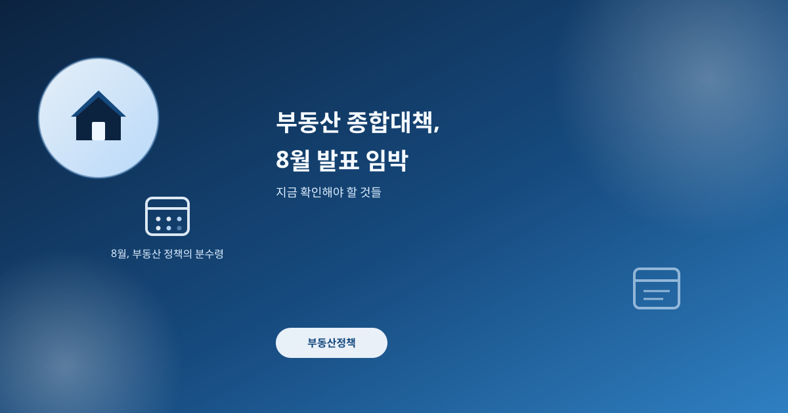
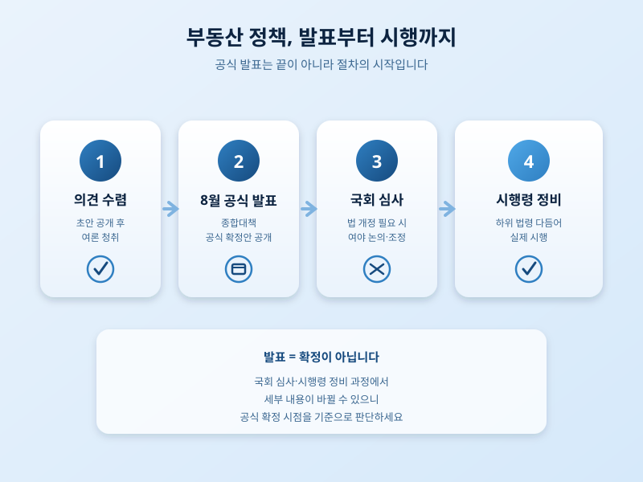

# 정부 부동산 종합대책, 8월 발표 임박 — 무엇을 확인해야 할까

  

8월이 시작되면서 부동산 시장의 시선은 다시 정부로 쏠리고 있다. 그동안 여러 차례 의견 수렴 절차를 거쳐온 부동산 종합대책이 8월 초 공식 발표를 앞두고 있다는 이야기가 나오면서, 이번엔 어떤 내용이 담길지에 관심이 집중되는 모습이다. 예년과 달리 정책 초안을 미리 공개하고 의견을 듣는 방식을 취해온 만큼, 실제 발표안이 그동안 알려진 밑그림과 얼마나 같을지가 첫 번째 관전 포인트다.

지금까지 논의 과정에서 언급돼온 내용을 보면, 공급 확대와 세제 조정이 함께 다뤄질 가능성이 거론된다. 공급 쪽에서는 주택 공급을 늘리기 위한 절차 개선이나 특정 지역 개발 계획이, 세제 쪽에서는 다주택자와 실수요자를 구분해 부담을 조정하는 방향이 논의돼온 것으로 알려졌다. 다만 이런 내용은 확정된 것이 아니라 논의 중인 방향이라는 점을 유의할 필요가 있다. 정책이 발표된다고 해서 곧바로 시행되는 것도 아니다. 법 개정이 필요한 부분은 국회 심사를 거쳐야 하고, 시행령이나 하위 법령 정비에도 시간이 걸린다. 그 사이 세부 내용이 조정될 가능성도 열려 있다.

  

이런 상황에서 실수요자가 취할 수 있는 가장 현실적인 태도는 발표 전부터 조급하게 움직이지 않는 것이다. 발표를 앞두고 시장에서는 여러 추측성 정보가 돌기 마련인데, 확정되지 않은 내용을 근거로 매수나 매도 시점을 서두르면 오히려 손해로 이어질 수 있다. 대신 본인의 자금 계획과 실거주 목적을 다시 점검하고, 공식 발표 이후 구체적인 조문이나 시행 시기가 나왔을 때 그것을 기준으로 판단하는 편이 안전하다.

부동산 정책은 발표 시점의 큰 그림보다 이후 국회 심사와 시행 과정에서 실제 내용이 다듬어지는 경우가 많다. 8월 발표를 하나의 이정표로 삼되, 그 이후 이어지는 절차까지 차분히 지켜보는 자세가 필요한 시점이다.

※ 이 초안은 AI가 생성했습니다. 게시 전 수치·정책 내용의 사실관계를 반드시 확인하세요.
