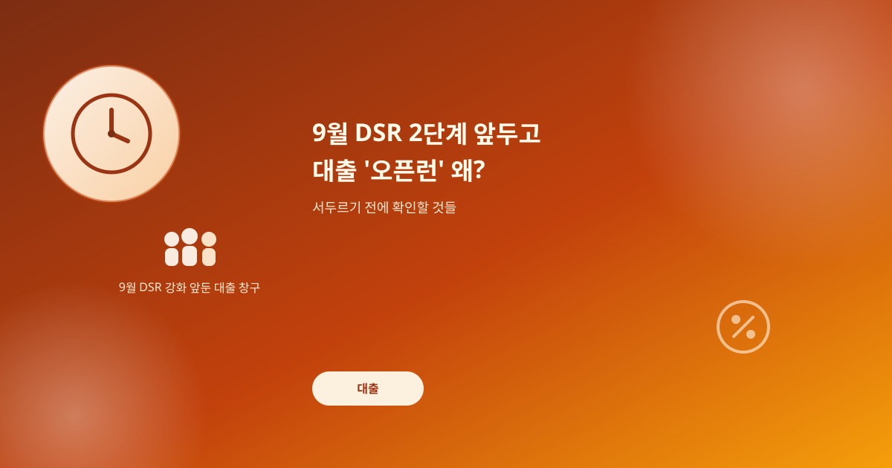
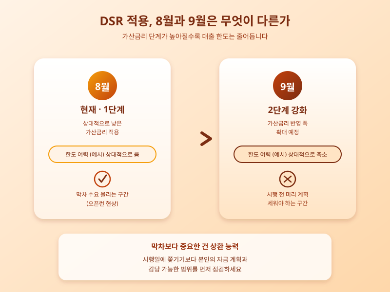

# 9월 DSR 2단계 강화 한 달 앞, 대출 '오픈런' 왜 벌어지나

  

8월 첫 영업일부터 은행 주택담보대출 창구에 예상치 못한 인파가 몰렸다. 대기줄이 늘어서고, 일부 지점은 오전 중 이번 달 한도를 소진했다는 이야기까지 나온다. 배경에는 다음 달 예정된 스트레스 DSR 2단계 강화가 있다. 규제가 까다로워지기 전에 대출을 받아두려는 수요가 몰린 것이다.

스트레스 DSR은 금리가 오를 가능성을 미리 반영해 대출 한도를 계산하는 방식이다. 단계가 강화될수록 가산금리가 높아지고, 같은 소득이라도 받을 수 있는 금액은 줄어든다. 9월 시행은 예고돼 있던 일정이지만, 임박하자 '지금이 아니면 늦는다'는 인식이 퍼지며 수요가 8월 초로 쏠렸다. 은행들은 영업점별 월 한도를 낮추고 보증보험 가입 조건도 조정하고 있다.

  

문제는 이런 '막차 심리'가 늘 합리적이지는 않다는 점이다. 대출부터 받아두려다 매수할 주택도 정하지 못한 채 자금부터 마련하거나, 필요 이상을 빌리는 경우가 생길 수 있다. 대출은 되돌리기 어려운 결정인 만큼, 시행 시점보다 상환 능력과 매수 계획이 우선이다.

지금 확인할 것은 명확하다. 본인에게 적용될 DSR 기준이 8월과 9월에 어떻게 달라지는지, 이용할 은행의 한도·보증보험 조건이 최근 바뀌었는지 점검하자. 시행일에 쫓기듯 움직이기보다 감당할 수 있는 범위 안에서 결정하는 편이 더 안전하다.

※ 이 초안은 AI가 생성했습니다. 게시 전 수치·정책 내용의 사실관계를 반드시 확인하세요.
