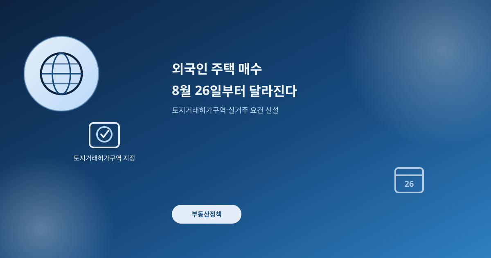
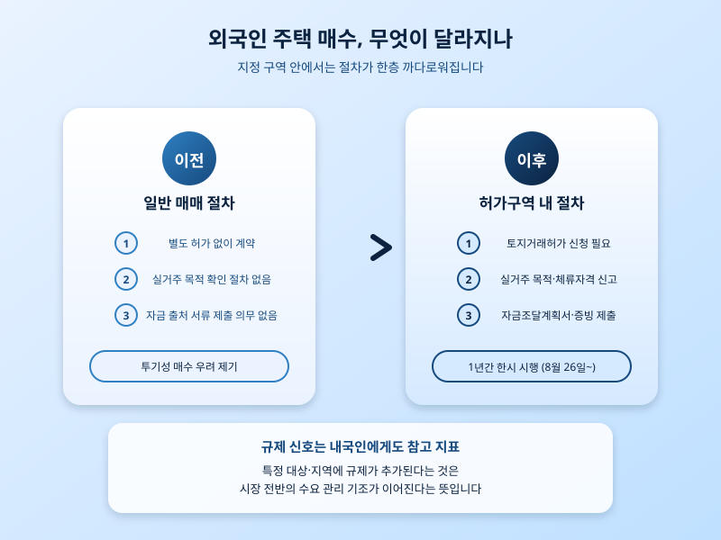

# 외국인 주택 매수, 8월 26일부터 이렇게 달라진다

  

오늘(8월 3일) 기준으로 정부가 수도권 주요 지역에 외국인 대상 토지거래허가구역을 지정하기로 하면서, 해당 구역 안에서 외국인이 주택을 사는 절차가 크게 달라진다. 시행은 8월 26일부터이고 적용 기간은 1년으로 예정돼 있다. 그동안 외국인 투기성 매수에 대한 우려가 꾸준히 제기돼 온 만큼, 이번 조치는 정부의 부동산 수요 관리 기조를 다시 한 번 보여주는 신호로 읽힌다.

핵심은 실거주 요건과 자금 출처 확인 절차가 함께 강화된다는 점이다. 지정 구역 안에서 주택을 사려는 외국인은 취득 후 일정 기간 실거주가 가능한 경우에만 거래할 수 있고, 체류자격과 국내 거소 여부도 함께 신고해야 한다. 여기에 자금조달계획서와 관련 입증 서류 제출까지 의무화되면서, 내국인 실수요자에게 이미 익숙한 절차가 외국인 매수 건에도 그대로 적용되는 셈이다. 그동안 내국인에게만 적용되던 검증 장치가 외국인 매수 건까지 넓어졌다는 점에서, 시장을 바라보는 정부의 시선이 한층 촘촘해졌다고 볼 수 있다.

  

이 조치가 내국인 실수요자와는 무관한 일처럼 보일 수 있지만, 실제로는 그렇지 않다. 정부가 특정 대상을 콕 집어 규제를 추가한다는 것은 시장 전반의 수요 관리 기조가 여전히 강하다는 뜻이고, 앞으로 추가 규제 카드가 나올 가능성도 배제하기 어렵다. 매수나 매도 시점을 저울질하고 있다면, 이런 정책 신호를 시장 분위기를 읽는 참고 지표로 함께 살펴볼 필요가 있다. 특정 지역에 규제가 집중된다는 것은 그만큼 해당 지역의 수요 압력이 높다는 방증이기도 해서, 역으로 관심 지역을 가늠하는 단서로 삼을 수도 있다.

지금 확인할 것은 두 가지다. 관심 있는 지역이 이번에 토지거래허가구역으로 지정되는지, 그리고 이후 발표될 후속 조치나 하위 규정에서 적용 범위가 더 넓어지지는 않는지다. 제도가 정식 시행되기 전까지는 세부 내용이 바뀔 수 있는 만큼, 발표 내용과 실제 시행 사이의 간극을 염두에 두고 판단하는 편이 안전하다. 정책 하나하나에 일희일비하기보다, 큰 흐름이 어디로 향하는지를 꾸준히 지켜보는 태도가 필요한 시점이다.

※ 이 초안은 AI가 생성했습니다. 게시 전 수치·정책 내용의 사실관계를 반드시 확인하세요.
