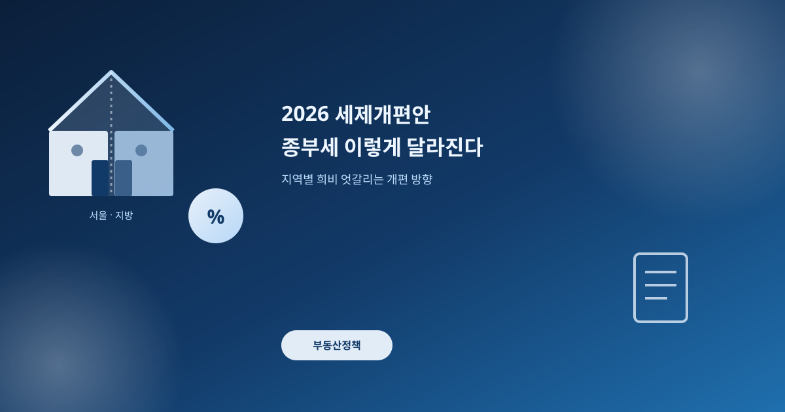
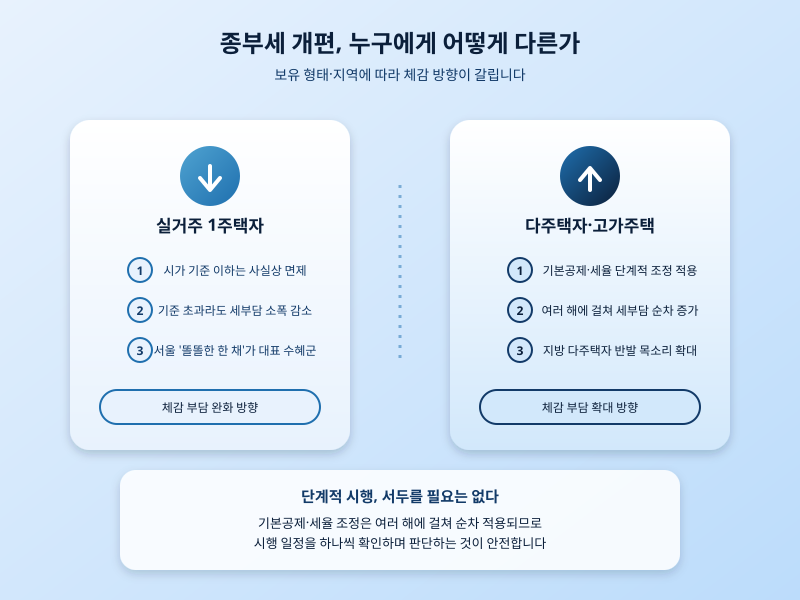

# 2026 세제개편안 발표, 종부세 이렇게 달라진다 — 지역별 희비 엇갈려

  

어제(8월 3일) 정부가 2026 세제개편안을 발표하면서 종합부동산세 체계에 변화가 생겼다. 핵심은 실거주 1주택자, 고가주택 보유자, 다주택자를 서로 다르게 대우하는 방향으로 세부담 구조를 다시 짠다는 점이다. 시가가 일정 기준 이하인 실거주 1주택자는 종부세 부담이 사실상 거의 없어지고, 그보다 비싼 고가주택이나 다주택을 보유한 경우에는 세부담이 여러 해에 걸쳐 단계적으로 늘어나는 그림이다. 한 번에 확 바뀌는 게 아니라 앞으로 몇 년에 걸쳐 순차적으로 적용된다는 점도 눈여겨볼 부분이다.

발표 직후 가장 크게 부각된 것은 지역 간 형평성 논란이다. 서울의 이른바 '똘똘한 한 채'는 실거주 요건을 충족하면 오히려 실질 부담이 줄어드는 반면, 그보다 집값은 낮아도 여러 채를 보유한 지방 다주택자는 세부담이 늘어나는 구조라는 지적이 나온다. 똑같이 '세제개편'이라는 이름으로 묶여 있지만 어디에 사는지, 몇 채를 갖고 있는지에 따라 체감하는 방향이 정반대로 갈리는 셈이다. 이 때문에 지역에서는 서울 위주 정책이라는 반발이 벌써부터 나오고 있다.

  

다만 이번 개편안이 발표됐다고 해서 당장 세금 고지서가 달라지는 것은 아니다. 여러 해에 걸쳐 단계적으로 적용되는 구조인 만큼, 기본공제나 세율 조정이 실제로 언제부터 어떤 순서로 들어가는지를 하나씩 확인하는 절차가 남아 있다. 보유 주택을 정리하거나 늘릴 계획이 있다면 발표 내용만 보고 서둘러 움직이기보다, 국회 논의 과정에서 세부 내용이 바뀔 가능성까지 열어두고 지켜보는 편이 안전하다.

결국 이번 세제개편안은 '누구에게 유리하고 누구에게 불리한가'라는 질문을 다시 던진 셈이다. 실거주 1주택자라면 당장 크게 걱정할 내용은 아니지만, 다주택자이거나 지방에 자산이 있는 경우라면 앞으로 몇 년간의 시행 일정을 챙겨보는 게 좋다. 정책 하나로 일희일비하기보다, 단계적으로 진행되는 흐름 전체를 놓고 판단하는 태도가 필요한 시점이다.

※ 이 초안은 AI가 생성했습니다. 게시 전 수치·정책 내용의 사실관계를 반드시 확인하세요.
