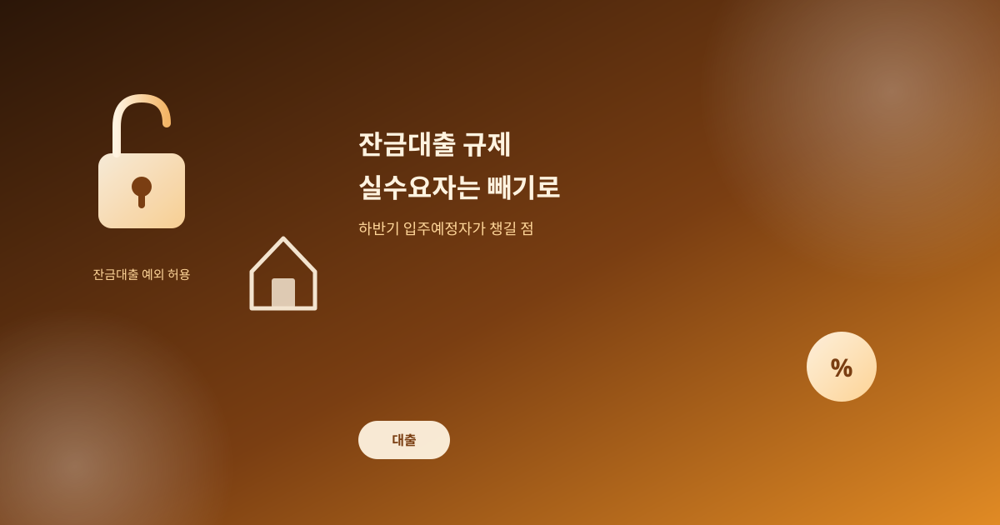
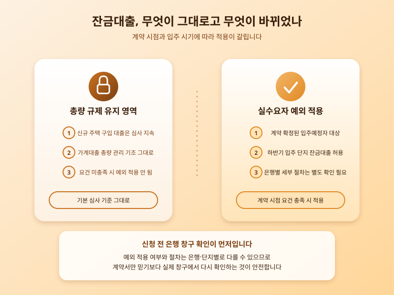

# 잔금대출 규제, 실수요자는 빼기로 — 하반기 입주예정자가 챙길 점

  

최근 가계대출을 둘러싼 이슈 중 가장 뜨거웠던 것은 단연 잔금대출이었다. 총량 관리라는 큰 틀 자체는 이해할 수 있지만, 몇 년 전에 이미 분양 계약을 마치고 입주만 기다려온 사람들이 정작 잔금을 치를 시점에 대출을 받지 못하는 상황이 벌어지면서 곳곳에서 불만이 터져 나왔다. 계약할 때는 존재하지도 않던 규제에 발목을 잡힌 셈이라는 목소리가 커지자, 금융당국은 총량 관리 기조는 유지하되 이미 계약이 확정된 입주예정자에 한해 잔금대출을 예외적으로 허용하는 쪽으로 방향을 틀었다.

이번 결정이 특히 눈길을 끄는 이유는 하반기에 입주를 앞둔 단지가 여러 곳 겹쳐 있는 시점에 나왔기 때문이다. 계획대로라면 비슷한 시기에 여러 단지에서 동시에 잔금 수요가 몰릴 상황이었던 만큼, 예외를 인정하지 않았다면 실수요자들의 혼란이 훨씬 커졌을 것이라는 평가가 나온다.

  

다만 대출 문턱 자체가 전반적으로 낮아진 것은 아니라는 점은 분명히 짚을 필요가 있다. 신규 주택 구입을 위한 대출은 여전히 까다로운 심사 기조가 유지될 가능성이 크고, 잔금대출 예외 역시 계약 시점이나 입주 시기 같은 요건을 충족해야만 적용된다. 즉 '누구나' 예외를 받는 것이 아니라 이미 계약을 마친 실수요자로 범위가 한정돼 있다는 뜻이다.

하반기 입주를 앞두고 있다면 이번 조치를 너무 안심하고 넘기기보다, 본인이 실제로 예외 요건에 해당하는지, 은행마다 적용 시점이나 세부 절차가 다르지는 않은지 미리 확인해 두는 편이 안전하다. 계약서만 있으면 무조건 된다고 단정하기보다, 실제 신청 전에 거래 은행 창구에서 한 번 더 확인하는 절차가 결국 시간을 아끼는 길이다.

결국 이번 사안은 '정책이 실수요자를 얼마나 세심하게 배려하는가'라는 질문을 다시 던진다. 총량 관리라는 큰 방향은 유지되더라도, 이미 계약을 마치고 입주만 기다려온 사람들까지 규제의 사각지대로 몰아넣지는 않겠다는 신호로 볼 수 있다. 다만 예외 요건과 절차는 상황에 따라 조정될 수 있는 만큼, 하반기 내내 관련 공지를 꾸준히 챙겨보는 태도가 필요하다.

※ 이 초안은 AI가 생성했습니다. 게시 전 수치·정책 내용의 사실관계를 반드시 확인하세요.
