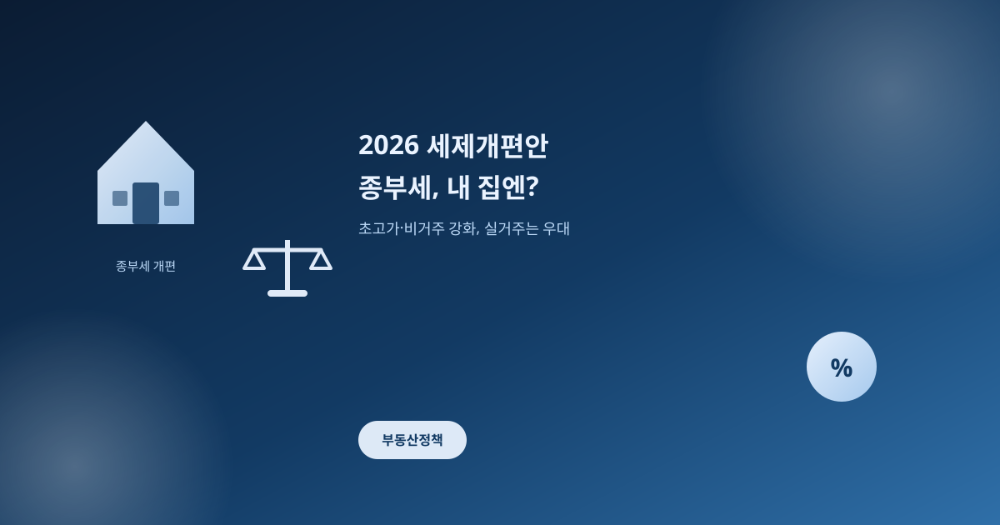
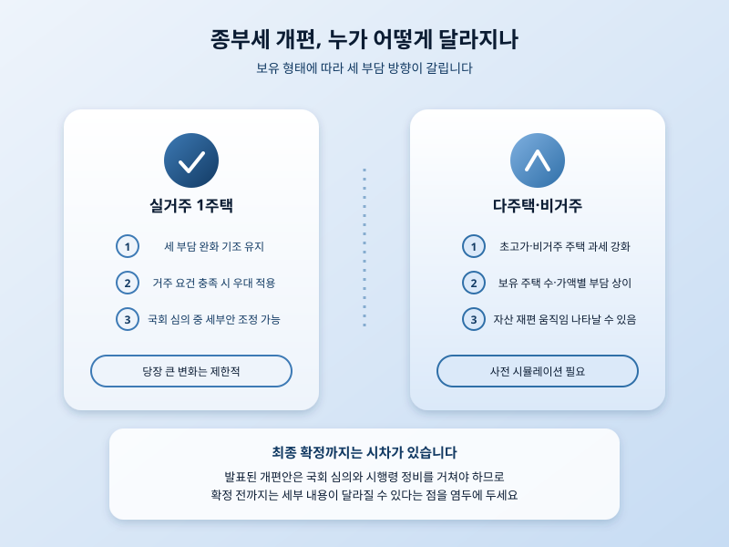

# 2026 세제개편안, 종부세 개편이 내 집에 미치는 영향은

  

최근 발표된 2026년 세제개편안에서 가장 뜨거운 화두는 단연 종합부동산세 개편이다. 초고가 주택과 비거주 주택에 대해서는 과세를 강화하는 방향이 담기면서, 부동산 시장 안팎에서 벌써부터 다양한 반응이 나오고 있다. 그동안 논란이 됐던 '똘똘한 한 채' 쏠림 현상을 완화하려는 취지로 읽히지만, 동시에 특정 계층을 겨냥한 징벌적 과세라는 반발도 만만치 않다.

이번 개편의 핵심은 고가이거나 실제로 거주하지 않는 주택을 보유한 경우 세 부담을 눈에 띄게 늘리는 데 있다. 반면 실거주 목적의 1주택자에 대해서는 상대적으로 부담을 완화하는 기조를 유지하려는 모습이어서, 결과적으로 '보유' 자체보다 '거주'를 우대하는 방향으로 정책의 무게중심이 옮겨가고 있다고 볼 수 있다. 이런 흐름이 이어지면 그동안 자산 가치가 높은 한 채에 집중하려던 수요가 오히려 다른 형태로 흩어질 수 있다는 관측도 나온다.

  

다주택자 입장에서는 보유 주택의 수와 가액에 따라 세 부담이 구체적으로 어떻게 달라지는지 미리 따져보는 일이 중요해졌다. 반대로 실거주 1주택자라면 당장은 크게 달라질 것이 없다고 안심하기보다, 이번 개편안이 국회 심의 과정에서 세부 내용이 조정될 가능성이 있다는 점을 염두에 두는 편이 좋다. 세제 개편은 발표만으로 끝나는 것이 아니라 입법과 시행령 정비를 거쳐야 실제로 적용되기 때문에, 최종 확정까지는 시차가 있을 수 있다.

결국 이번 세제개편안은 부동산을 '거주 공간'으로 볼 것인가 '자산'으로 볼 것인가에 대한 정책적 답을 담고 있다. 어느 쪽에 속하든 이번 논의가 어떻게 마무리되는지에 따라 앞으로의 매매·보유 전략이 달라질 수 있는 만큼, 국회 심의 과정과 최종 시행 일정을 계속 주시할 필요가 있다.

※ 이 초안은 AI가 생성했습니다. 게시 전 수치·정책 내용의 사실관계를 반드시 확인하세요.
