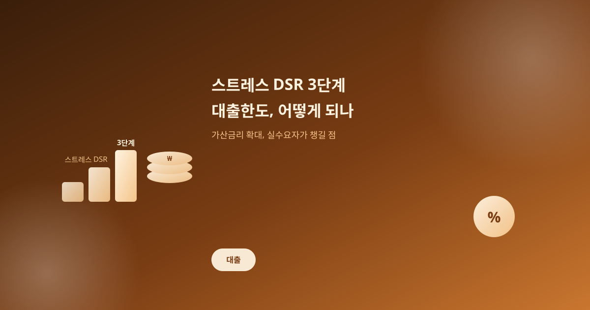
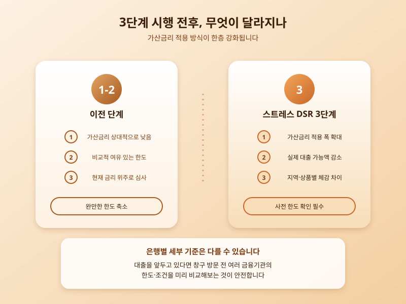

# 스트레스 DSR 3단계 시행, 대출한도 이렇게 달라진다

  

이번 달부터 스트레스 DSR 3단계가 본격 시행되면서 대출을 준비 중인 실수요자들의 관심이 뜨겁다. 스트레스 DSR은 앞으로 금리가 오를 가능성을 미리 계산에 넣어 대출 한도를 산정하는 제도로, 단계가 올라갈수록 적용되는 가산금리 폭이 커진다는 점에서 이번 3단계 시행은 대출 시장에 적지 않은 파장을 일으킬 전망이다.

기존에는 현재 금리를 기준으로 상환 능력을 평가했다면, 스트레스 DSR은 여기에 일정 수준의 가산금리를 더해 '금리가 오르더라도 갚을 수 있는가'를 기준으로 심사한다. 결과적으로 서류상 소득이나 담보 가치가 같더라도 이전보다 받을 수 있는 대출 금액 자체가 줄어드는 구조다. 3단계에서는 이 가산금리 적용 폭이 한층 확대되면서, 특히 한도를 끝까지 채워 대출을 받으려던 사람들이 체감하는 변화가 클 것으로 보인다.

  

다만 그 영향은 모두에게 똑같이 나타나지는 않는다. 수도권이나 규제지역처럼 상대적으로 대출 수요가 집중된 지역과 규제 강도가 낮은 지방 사이에는 가산금리 적용 방식에 차이를 두고 있어, 지역에 따라 체감하는 한도 축소 폭이 달라질 수 있다. 또한 주택담보대출과 신용대출 등 대출 종류에 따라서도 스트레스 금리가 반영되는 방식이 다르기 때문에, 어떤 상품을 이용하느냐에 따라 실제로 받을 수 있는 금액 차이가 벌어질 수 있다.

대출을 앞두고 있다면 은행 창구를 찾기 전에 미리 한도를 가늠해보는 것이 좋다. 은행별로 심사 기준이나 우대 조건을 조금씩 다르게 운용하는 경우가 많아, 한 곳에서 한도가 부족하다고 해서 곧바로 계획을 포기하기보다는 여러 금융기관의 조건을 비교해보는 편이 유리하다. 특히 잔금 납부나 이사 일정처럼 시점이 정해진 자금 계획이 있다면, 예상보다 한도가 줄어들 가능성을 감안해 여유 자금이나 대안을 함께 마련해두는 것이 안전하다.

제도 시행 초기에는 은행별로 적용 시점이나 세부 기준에서 다소 혼선이 빚어질 수 있는 만큼, 대출을 계획 중이라면 해당 은행의 최신 공지사항을 직접 확인하고 상담을 받아보는 것이 가장 확실한 방법이다. 결국 스트레스 DSR 3단계는 '더 신중하게, 더 여유 있게' 대출 계획을 세우라는 신호로 받아들이는 것이 현명해 보인다.

※ 이 초안은 AI가 생성했습니다. 게시 전 수치·정책 내용의 사실관계를 반드시 확인하세요.
