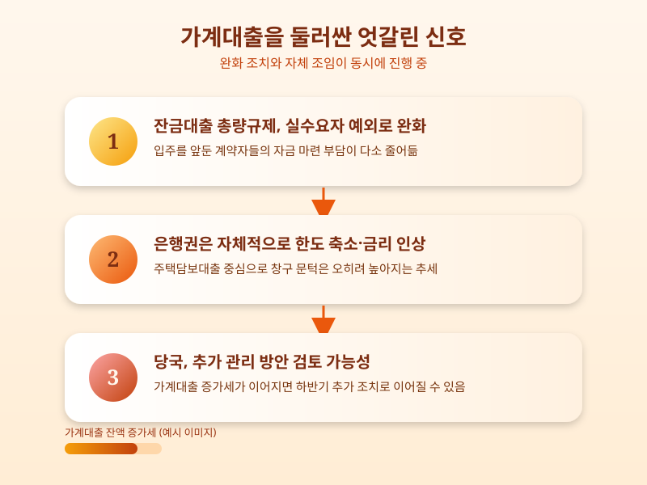

# 가계대출, 다시 역대 최고치 — 정부는 왜 또 조이기를 고민할까

  

최근 5대 은행의 가계대출 잔액이 다시 역대 최고 수준을 기록했다는 소식이 전해졌다. 하반기 들어 잠시 숨통이 트인 듯했던 대출 시장이 다시 술렁이는 모습이다. 무엇이 달라졌고, 왜 다시 관리 강화 이야기가 나오는지 정리해본다.

올여름 금융당국은 입주를 앞둔 실수요자들의 어려움을 감안해 잔금대출에 대한 총량 규제를 실수요자에 한해 완화하는 쪽으로 방향을 틀었다. 계약을 마치고 입주만 기다리던 사람들 입장에서는 반가운 소식이었다. 그런데 이 완화 조치와 별개로, 은행들은 오히려 자체적으로 주택담보대출 한도를 낮추고 금리를 올리는 움직임을 보이고 있다. 당국의 큰 틀에서는 숨통이 트였는데, 정작 창구에서 체감하는 문턱은 오히려 더 높아진 셈이다.

  

이런 엇갈린 신호가 함께 나오는 이유는 비교적 단순하다. 잔금대출처럼 이미 계약이 끝난 실수요자를 위한 예외는 열어두되, 전체 가계대출 증가세 자체는 여전히 부담스럽다는 인식이 당국과 은행권 모두에 깔려 있기 때문이다. 실제로 최근 발표된 은행권 통계를 보면 가계대출 증가분의 상당 부분이 주택담보대출에서 나오고 있어, 집을 사고 옮기는 수요가 꾸준히 이어지고 있음을 짐작하게 한다. 이런 흐름이 계속되면 당국이 하반기 안에 추가적인 관리 방안을 내놓을 가능성도 배제하기 어렵다는 관측이 나온다.

결국 지금 대출을 계획 중이라면 '총량 규제가 완화됐다'는 소식만 보고 안심하기보다는, 실제 이용하려는 은행의 최신 한도와 금리 조건을 직접 확인하는 편이 안전하다. 은행마다, 그리고 시점마다 조건이 빠르게 바뀌고 있는 만큼 잔금 시점이나 대출 실행일이 가까운 사람일수록 은행 창구나 상담을 통해 미리 조건을 점검해두는 것이 좋겠다. 정책의 큰 방향과 개별 은행의 실제 조건은 다르게 움직일 수 있다는 점을 기억해두자.

※ 이 초안은 AI가 생성했습니다. 게시 전 수치·정책 내용의 사실관계를 반드시 확인하세요.
