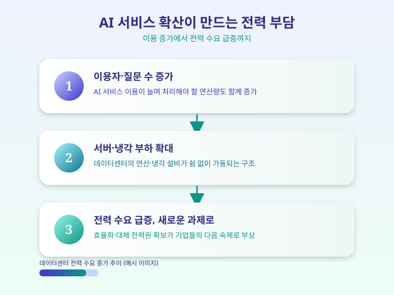

# AI 데이터센터, 전기 먹는 하마 되나

  

챗봇이나 AI 검색을 쓸 때마다 우리는 잘 느끼지 못하지만, 그 뒤에는 방대한 데이터센터가 쉼 없이 돌아가고 있다. 최근 국내외에서 AI 서비스 확산과 함께 데이터센터의 전력 소비량이 새로운 화두로 떠오르고 있다. AI가 똑똑해질수록 전기를 먹는 양도 함께 늘어난다는 사실이, 이제는 산업 전반의 현실적인 고민거리가 되고 있는 셈이다.

생성형 AI 모델은 학습 단계뿐 아니라 실제로 서비스를 제공하는 추론 단계에서도 상당한 연산을 필요로 한다. 이용자가 늘고 질문이 복잡해질수록 서버가 처리해야 할 연산량도 함께 늘어나는데, 이 연산을 감당하는 것이 바로 데이터센터의 서버와 이를 식히는 냉각 설비다. 문제는 이 설비들이 쓰는 전력량이 예상보다 빠르게 불어나고 있다는 점이다. 그래서 데이터센터를 새로 짓는 기업들은 이제 서버를 몇 대 놓을지 못지않게, 전력을 어디서 얼마나 안정적으로 확보할지를 함께 고민해야 하는 상황에 놓였다.

  

이런 흐름 속에서 빅테크와 클라우드 기업들은 여러 방향으로 대응에 나서고 있다. 일부는 데이터센터 자체를 더 효율적으로 설계해 같은 연산을 더 적은 전력으로 처리하려 하고, 다른 일부는 재생에너지나 소형 원자로 같은 대체 전력원 확보에 직접 투자하는 방식을 택하고 있다. 국내에서도 데이터센터가 밀집한 지역을 중심으로 전력망 확충 논의가 이어지고 있으며, 인근 주민들과의 갈등이나 전기요금 부담 문제도 함께 거론되는 분위기다.

AI 서비스는 이제 우리 일상 곳곳의 도구가 됐지만, 그 이면에는 눈에 잘 띄지 않는 전력 인프라라는 현실적인 제약이 자리하고 있다. 앞으로 AI 산업이 얼마나 빠르게, 그리고 얼마나 지속가능한 방식으로 성장할 수 있을지는 결국 이 전력 문제를 어떻게 풀어가느냐에 달려 있다고 봐도 무리가 아니다. 화려한 AI 소식들 이면에서 조용히 벌어지고 있는 이 줄다리기를, 앞으로도 눈여겨볼 필요가 있다.

※ 이 초안은 AI가 생성했습니다. 게시 전 수치·정책 내용의 사실관계를 반드시 확인하세요.
