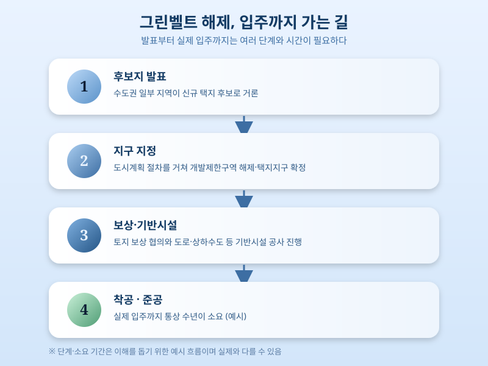

# 수도권 그린벨트 해제 카드, 이번엔 통할까

  

주택 공급이 부족하다는 이야기가 나올 때마다 어김없이 등장하는 카드가 있다. 바로 개발제한구역, 이른바 그린벨트 해제다. 최근 수도권 신규 택지를 확보하기 위한 방안 중 하나로 그린벨트 해제가 다시 검토되고 있다는 이야기가 흘러나오면서, 이번에는 정말 공급 확대로 이어질지 관심이 모이고 있다.

그린벨트는 도시가 무분별하게 팽창하는 것을 막고 녹지를 보전하기 위해 지정된 구역이다. 그런데도 역대 정부들은 주택 공급이 급할 때마다 예외적으로 일부 구역을 풀어 신규 택지로 활용해왔다. 이번에도 비슷한 흐름이 감지된다. 수도권 인근 일부 지역이 후보지로 거론되고 있고, 교통망 확충과 함께 대규모 주거단지를 조성하는 방안이 논의되는 것으로 알려졌다.

  

문제는 그린벨트 해제 발표가 곧바로 공급 확대로 이어지지는 않는다는 점이다. 후보지를 확정하고 지구를 지정한 뒤 토지 보상, 기반시설 공사를 거쳐 실제 입주까지 이어지려면 상당한 시간이 걸린다. 과거 사례들을 보면 계획 발표 이후 실제 준공까지 여러 해가 걸린 경우가 많았고, 그 사이 시장 상황이 바뀌면서 애초 취지가 흐려지기도 했다. 여기에 환경단체와 지역 주민들의 반발도 매번 넘어야 할 과제로 남아 있다.

결국 그린벨트 해제는 공급 정책의 만능 해법이라기보다는, 시간이 걸리는 여러 카드 중 하나로 봐야 한다는 목소리가 나온다. 실수요자 입장에서는 이런 발표가 나올 때마다 단기적인 기대감보다는, 실제 지구 지정과 사업 진행 속도를 차분히 지켜보는 태도가 필요해 보인다. 그린벨트 해제가 이번에는 정말 수도권 주택 공급으로 이어질지, 아니면 또 하나의 논의로만 그칠지 앞으로의 진행 상황을 지켜볼 필요가 있다.

※ 이 초안은 AI가 생성했습니다. 게시 전 수치·정책 내용의 사실관계를 반드시 확인하세요.
