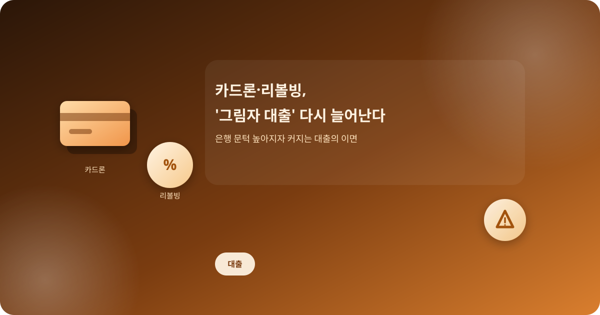
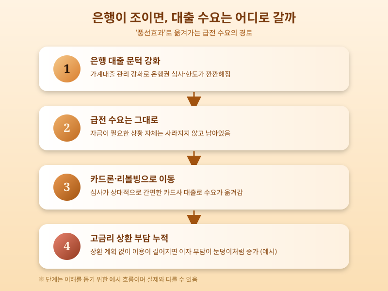

# 카드론·리볼빙, '그림자 대출'이 다시 늘어나는 이유

  

은행 문이 좁아질 때마다 어김없이 벌어지는 일이 있다. 급전이 필요한 사람들이 은행 대신 카드사로 발길을 돌리는 것이다. 최근 은행권 가계대출 관리가 강화되면서 카드론과 리볼빙 이용이 다시 늘고 있다는 이야기가 나온다. 이런 대출을 두고 '그림자 대출'이라는 표현이 쓰이는 이유는, 제도권 금융이면서도 그 규모와 위험이 상대적으로 눈에 잘 띄지 않기 때문이다.

카드론은 신용카드 회원을 대상으로 한 카드사의 신용대출이고, 리볼빙(일부결제금액이월약정)은 이번 달 카드값 중 일부만 갚고 나머지는 다음 달로 넘기는 결제 방식이다. 둘 다 별도의 담보나 복잡한 심사 없이 비교적 빠르게 이용할 수 있다는 공통점이 있다. 문제는 이 편리함의 대가가 상당히 크다는 점이다. 은행 대출보다 금리가 높은 경우가 많고, 리볼빙은 상환을 미룰수록 이자가 이자를 낳는 구조여서 잔액이 눈덩이처럼 불어나기 쉽다.

  

은행이 대출 문턱을 높이면 자금 수요가 사라지는 게 아니라 다른 통로로 옮겨갈 뿐이라는 게 이른바 '풍선효과'다. 실제로 은행권 조이기가 이어질 때마다 카드사·저축은행 등 2금융권 대출이 늘어나는 흐름이 반복돼 왔다. 당장 급한 불을 끄기엔 편리하지만, 상환 계획 없이 이용을 이어가면 감당하기 어려운 부담으로 돌아올 수 있다는 점에서 주의가 필요하다.

카드론이나 리볼빙을 이용하기 전에는 몇 가지를 반드시 따져봐야 한다. 실제 적용 금리가 얼마인지, 매달 얼마씩 갚아야 원금이 실질적으로 줄어드는지, 다른 대안(정책금융상품이나 저금리 대환 상품 등)은 없는지를 먼저 확인하는 것이 순서다. 급할수록 돌아가라는 말처럼, 눈앞의 편리함보다 상환 가능성을 먼저 계산해보는 습관이 결국 가계 재정을 지키는 가장 확실한 방법이다.

※ 이 초안은 AI가 생성했습니다. 게시 전 수치·정책 내용의 사실관계를 반드시 확인하세요.
