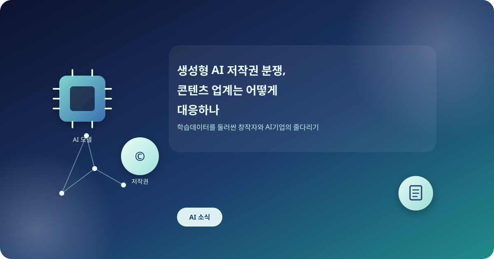
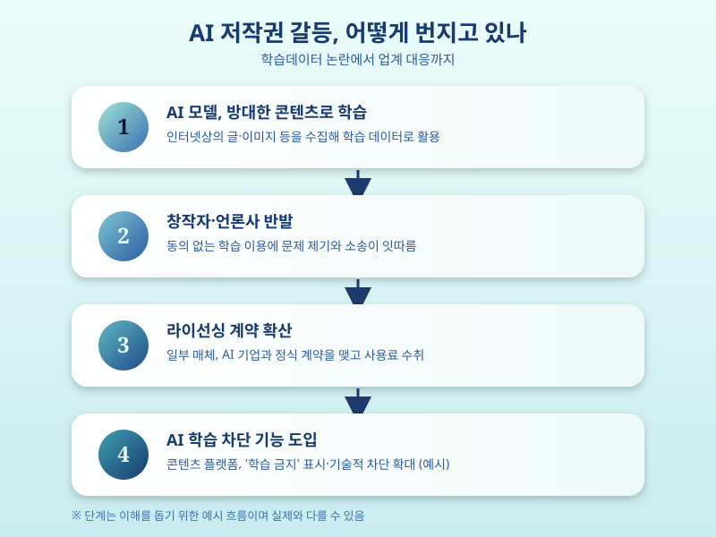

# 생성형 AI 저작권 분쟁, 콘텐츠 업계는 어떻게 대응하나

  

최근 생성형 AI 서비스가 빠르게 확산되면서 학습 데이터로 사용된 저작물의 권리 문제가 다시 도마에 올랐다. 글, 그림, 음악, 영상 등 다양한 콘텐츠가 AI 모델 학습에 활용되는 과정에서 원저작자의 동의나 대가 없이 사용됐다는 지적이 이어지면서, 창작자와 언론사, 콘텐츠 기업들이 목소리를 내기 시작했다.

문제의 핵심은 AI 기업들이 인터넷상의 방대한 텍스트와 이미지를 수집해 모델을 학습시키는 과정에 있다. 공개된 자료라 하더라도 저작권이 살아있는 콘텐츠를 별도의 허락 없이 활용한 것 아니냐는 문제 제기가 이어지고 있고, 해외에서는 작가·언론사가 AI 기업을 상대로 소송을 제기한 사례도 여럿 나왔다. 국내에서도 창작자 단체를 중심으로 AI 학습 데이터 사용에 대한 명확한 기준을 마련해야 한다는 목소리가 커지는 중이다.

  

이에 대응해 콘텐츠 업계는 여러 갈래로 움직이고 있다. 일부 언론사와 출판사는 AI 기업과 정식 라이선싱 계약을 맺고 콘텐츠 사용료를 받는 방식을 택했고, 반대로 자사 콘텐츠의 AI 학습을 원천 차단하겠다며 기술적 장치를 도입하는 곳도 늘고 있다. 창작 플랫폼들도 저작물에 'AI 학습 금지' 표시를 붙일 수 있는 기능을 속속 도입하는 추세다. 다만 국내외 모두 저작권과 AI 학습의 경계를 명확히 규정한 법과 제도가 아직 자리 잡지 못한 상태라, 개별 기업의 대응만으로는 한계가 있다는 지적도 나온다.

콘텐츠를 만들어 온 입장에서든, AI 서비스를 이용하는 입장에서든 이 문제는 남의 일이 아니다. 창작자라면 자신의 저작물이 AI 학습에 활용되는 것을 원치 않을 경우 이를 표시하거나 차단할 방법이 있는지 미리 확인해두는 것이 좋다. AI 서비스를 업무나 콘텐츠 제작에 활용하는 이용자 역시 결과물의 저작권 문제가 아직 완전히 정리되지 않았다는 점을 인지하고, 상업적으로 활용할 때는 각별히 주의를 기울일 필요가 있다. 저작권과 기술 혁신이 어떻게 균형점을 찾아갈지는 앞으로도 계속 지켜볼 대목이다.

※ 이 초안은 AI가 생성했습니다. 게시 전 수치·정책 내용의 사실관계를 반드시 확인하세요.
