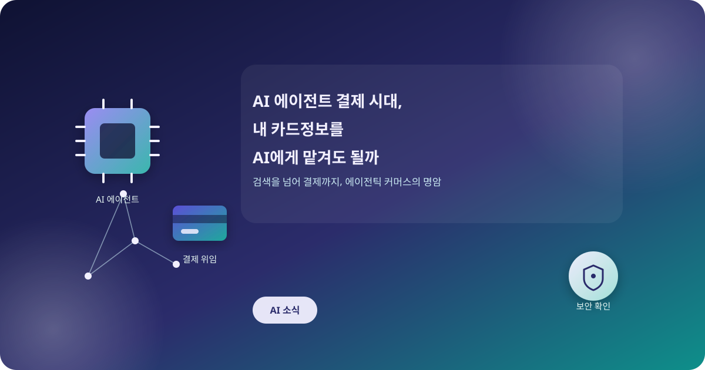
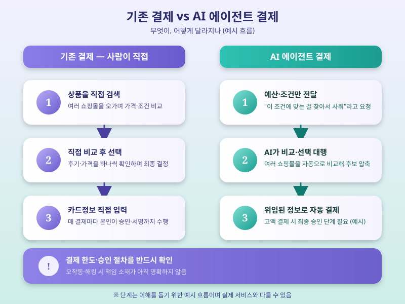

# AI 에이전트 결제 시대, 내 카드정보를 AI에게 맡겨도 될까

  

요즘 AI 챗봇에게 "이 조건에 맞는 물건을 찾아서 사줘"라고 말하면 정말로 검색부터 결제까지 대신 처리해주는 서비스가 하나둘 등장하고 있다. 이른바 '에이전틱 커머스'로 불리는 이 흐름은 AI가 단순히 정보를 찾아주는 도구를 넘어, 실제로 돈을 쓰는 주체가 될 수 있다는 점에서 이전과는 다른 차원의 변화를 예고한다. 해외 주요 빅테크와 결제사들이 관련 기능을 잇달아 선보이면서, 국내에서도 이 서비스가 언제 어떤 방식으로 들어올지에 관심이 모인다.

에이전틱 커머스의 핵심은 사용자가 예산과 조건만 정해주면 AI가 여러 쇼핑몰을 비교하고, 최적의 상품을 골라 결제까지 자동으로 처리한다는 데 있다. 이를 위해서는 AI가 사용자의 결제 수단 정보를 어떤 형태로든 위임받아야 하는데, 카드사와 플랫폼들은 거래마다 일회성 가상 결제 정보를 발급하는 방식 등으로 위험을 줄이려 하고 있다. 다만 아직 초기 단계인 기술인 만큼, AI가 사용자의 의도를 잘못 해석해 원치 않는 상품을 구매하거나 예산을 초과해 결제하는 오작동 가능성도 함께 거론된다.

  

더 근본적인 우려는 보안이다. AI 에이전트에게 결제 권한을 위임하는 과정에서 해킹이나 프롬프트 조작으로 제3자가 결제를 가로챌 여지가 있고, 문제가 생겼을 때 책임 소재를 가리기도 쉽지 않다. 이 때문에 해외에서는 AI 결제에 한도를 설정하거나 고액 결제는 반드시 사용자의 최종 승인을 거치도록 하는 안전장치를 함께 마련하는 추세다. 국내 금융권과 플랫폼 업체들도 이런 해외 사례를 지켜보며 도입 시점과 방식을 저울질하고 있는 것으로 보인다.

아직은 낯설게 느껴지는 서비스지만, 검색에서 실행으로 넘어가는 AI의 진화 속도를 감안하면 에이전틱 커머스가 일상에 들어오는 것은 시간문제일 수 있다. 이용을 고려한다면 결제 한도를 미리 설정해두고, 고액 거래에는 반드시 별도 승인 절차가 있는지 확인하는 습관을 들이는 것이 좋다. 편리함 뒤에 따라오는 책임과 위험을 함께 이해하는 태도가, 이 새로운 결제 방식을 안전하게 받아들이는 첫걸음이 될 것이다.

※ 이 초안은 AI가 생성했습니다. 게시 전 수치·정책 내용의 사실관계를 반드시 확인하세요.
