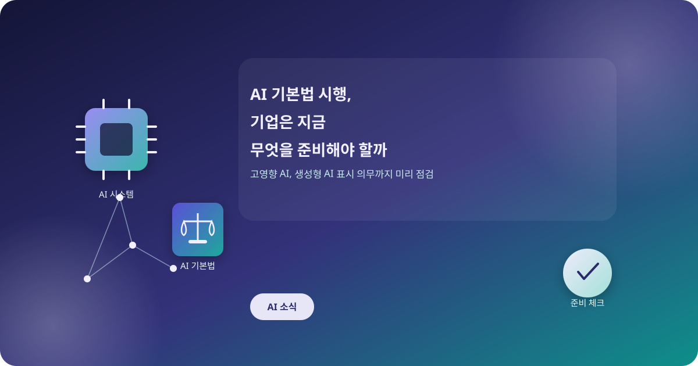
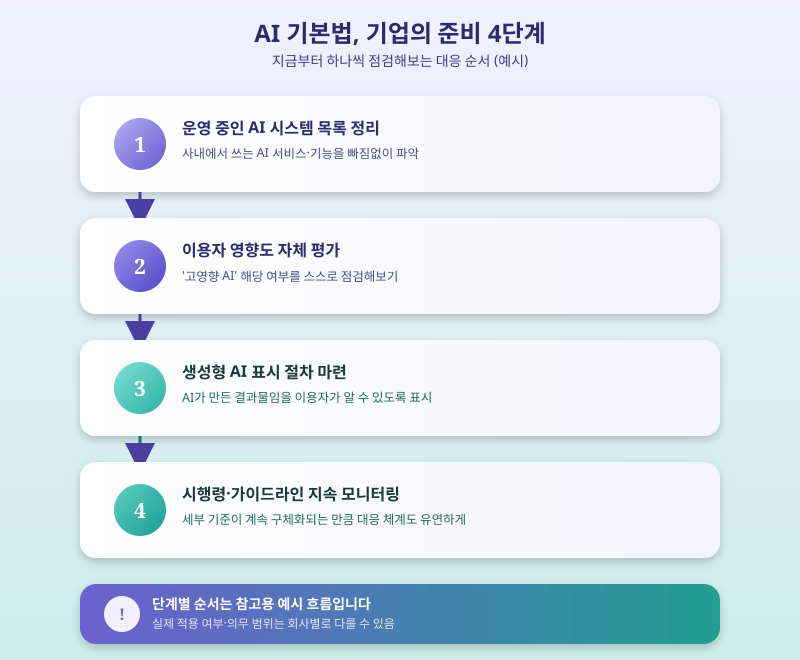

# AI 기본법 시행, 기업은 지금 무엇을 준비해야 할까

  

올해부터 국내에서도 인공지능 관련 기본법이 시행되며, AI를 개발하거나 서비스에 활용하는 기업들의 발걸음이 분주해지고 있다. 그동안 자율적인 가이드라인 수준에 머물렀던 AI 관련 규범이 법적 의무로 전환되면서, 이제는 준비 여부에 따라 기업의 리스크 관리 수준이 크게 갈릴 것으로 보인다. 특히 생성형 AI로 콘텐츠를 만들거나 의사결정을 돕는 시스템을 운영하는 기업이라면 이번 법 시행이 결코 남의 이야기가 아니다.

이번 법의 핵심은 국민의 안전이나 권익에 미치는 영향이 큰 서비스를 '고영향 AI'로 별도 규정하고, 이를 개발·운용하는 사업자에게 위험관리체계 구축 등 추가적인 의무를 부과한다는 데 있다. 또한 생성형 AI로 만든 결과물임을 이용자가 알 수 있도록 표시하게 하는 의무도 함께 담겨 있어, 텍스트나 이미지, 영상 콘텐츠를 다루는 서비스라면 표시 방식부터 다시 점검해볼 필요가 있다.

  

문제는 아직 많은 기업들이 자사의 AI 시스템이 '고영향' 범주에 해당하는지조차 명확히 판단하지 못하고 있다는 점이다. 법 조문은 포괄적인 기준을 제시하지만 구체적인 적용 사례나 세부 지침은 계속 보완되는 중이어서 현장에서는 혼란이 적지 않다. 인력과 예산이 한정된 스타트업이나 중소기업일수록 이런 준법 대응 부담을 더 크게 느낄 수밖에 없다.

그럼에도 지금 단계에서 기업이 할 수 있는 일은 비교적 분명하다. 우선 자사가 운영 중인 AI 시스템과 서비스 목록을 정리하고, 각각이 이용자에게 미치는 영향의 정도를 스스로 평가해보는 작업부터 시작하는 것이 좋다. 생성형 AI로 만든 콘텐츠에는 출처나 AI 활용 여부를 표시하는 절차를 미리 마련해두는 것도 필요하다. 법 시행 초기에는 시행령과 세부 가이드라인이 계속 구체화될 가능성이 큰 만큼, 관련 공지를 주기적으로 확인하며 대응 체계를 유연하게 조정해나가는 자세가 무엇보다 중요하다.

※ 이 초안은 AI가 생성했습니다. 게시 전 수치·정책 내용의 사실관계를 반드시 확인하세요.
