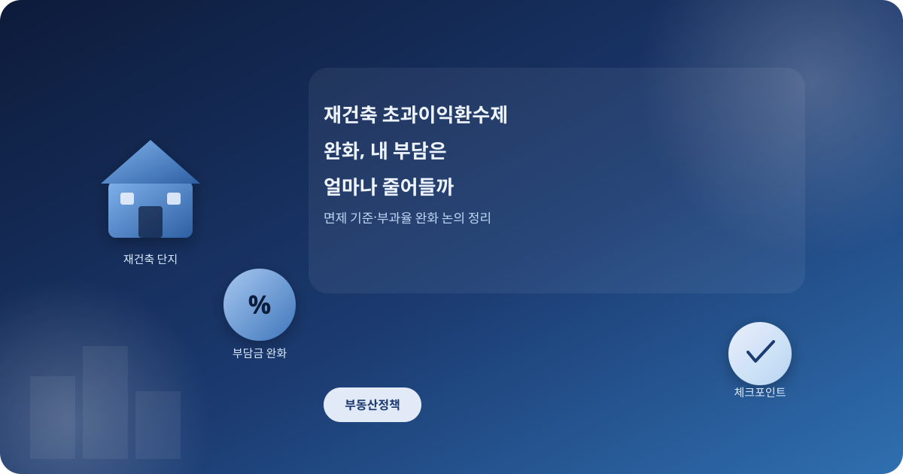
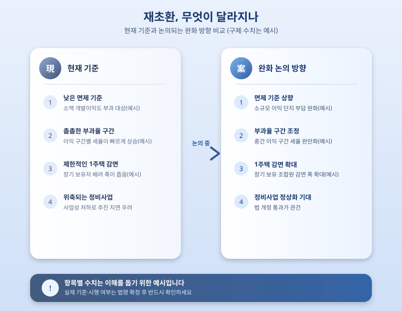

# 재건축 초과이익환수제 완화, 내 부담은 실제로 얼마나 줄어들까

  

최근 정비사업 활성화를 위해 재건축 초과이익환수제, 이른바 '재초환' 완화 논의가 다시 도마 위에 올랐다. 사업성 저하로 재건축 추진에 어려움을 겪던 조합들 사이에서는 완화 소식에 기대감이 커지는 분위기지만, 정작 내가 사는 단지에 실제로 어떤 변화가 생기는지 구체적으로 아는 사람은 많지 않다. 오늘은 재초환 제도가 무엇이고, 최근 어떤 방향으로 완화 논의가 이뤄지고 있는지 정리해본다.

재초환은 재건축 사업을 통해 조합원 1인당 평균 개발이익이 일정 기준을 넘어설 경우, 초과한 금액의 일부를 국가가 부담금 형태로 환수하는 제도다. 집값 급등기에 재건축을 통한 과도한 시세차익을 억제하겠다는 취지로 도입됐지만, 시행 이후에는 사업성을 지나치게 낮춰 정비사업 자체를 위축시킨다는 지적이 꾸준히 제기돼 왔다. 특히 공사비가 크게 오른 최근에는 부담금 부과 대상이 되는 단지가 늘면서 조합들의 불만도 함께 커지는 상황이다.

  

이런 배경에서 최근 논의되는 완화 방향은 크게 세 갈래로 나뉜다. 면제 기준 금액을 높이는 안, 부과율 구간을 조정해 초과이익이 크지 않은 단지의 부담을 낮추는 안, 그리고 장기 보유한 1주택 조합원에 대한 감면 폭을 넓히는 안이다. 다만 이는 아직 국회 논의 단계에 머물러 있는 방향성일 뿐이며, 구체적인 수치나 적용 시점은 법 개정 절차를 거쳐야 확정된다는 점을 유념할 필요가 있다.

재건축을 앞둔 소유주라면 우리 단지가 재초환 부과 대상에 해당하는지, 조합이 현재 어느 사업 단계에 있는지부터 확인해보는 것이 우선이다. 완화안이 실제로 통과되기까지는 시간이 걸릴 수 있는 만큼, 섣불리 부담이 크게 줄어들 것이라 기대하기보다는 조합 공지와 국회·정부의 발표를 꾸준히 지켜보며 대응 계획을 세우는 것이 현명하다.

※ 이 초안은 AI가 생성했습니다. 게시 전 수치·정책 내용의 사실관계를 반드시 확인하세요.
