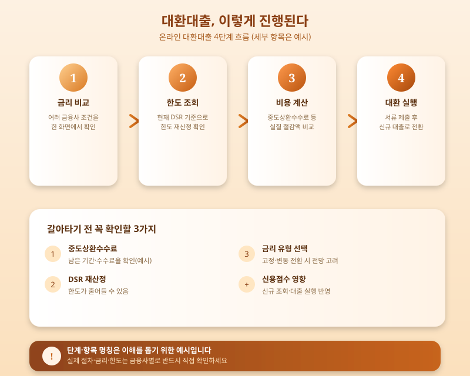

# 가계대출 관리 강화 국면, 대환대출로 갈아타기 지금 유리할까

  

최근 은행권이 가계대출 총량을 조이고 스트레스 DSR 규제까지 이어지면서 신규 대출을 받으려는 사람들의 문턱은 눈에 띄게 높아졌다. 반면 이미 대출을 보유한 차주들 사이에서는 조금이라도 유리한 조건으로 갈아타려는 '대환대출' 문의가 다시 늘고 있다. 신규 대출은 조이는데 기존 대출을 손보는 선택지는 오히려 주목받는 분위기다. 오늘은 대환대출이 무엇이고, 지금 시점에 갈아타는 것이 실제로 유리한 선택인지 정리해본다.

대환대출은 기존에 받은 대출을 상환하고 더 낮은 금리나 더 나은 조건의 새 대출로 옮겨가는 것을 말한다. 몇 년 전부터 도입된 온라인·원스톱 대환대출 인프라 덕분에 여러 금융사의 금리와 한도를 한 번에 비교하고, 영업점을 여러 번 방문하지 않아도 갈아타기를 진행할 수 있게 됐다는 점이 가장 큰 변화다. 다만 가계대출 관리가 강화된 지금은 대환 심사에서도 소득 대비 상환능력을 다시 따지는 절차가 예전보다 꼼꼼해졌다는 점을 감안할 필요가 있다.

  

대환대출이 무조건 유리한 것은 아니다. 먼저 기존 대출에 중도상환수수료가 남아 있다면 금리를 낮추더라도 실제 절감액이 줄어들 수 있고, 대출 실행 시점의 DSR 기준으로 한도가 다시 산정되기 때문에 오히려 한도가 줄어드는 경우도 있다. 또한 변동금리에서 고정금리로, 혹은 그 반대로 유형을 바꾸는 경우라면 향후 금리 전망까지 함께 고려해야 후회 없는 선택이 된다. 신용점수에 미치는 영향도 미리 확인해두는 편이 안전하다.

결국 대환대출은 '금리가 조금이라도 낮아지면 무조건 이득'이라는 단순 계산으로 접근할 문제가 아니다. 남은 대출 기간, 중도상환수수료, 새로 적용되는 DSR 기준까지 함께 계산해 실질적으로 얼마나 절감되는지를 따져본 뒤 결정하는 것이 바람직하다. 온라인 대환대출 플랫폼에서 여러 조건을 미리 비교해보고, 필요하다면 금융사 상담을 통해 정확한 한도와 금리를 확인한 후 움직이는 것을 권한다.

※ 이 초안은 AI가 생성했습니다. 게시 전 수치·정책 내용의 사실관계를 반드시 확인하세요.
