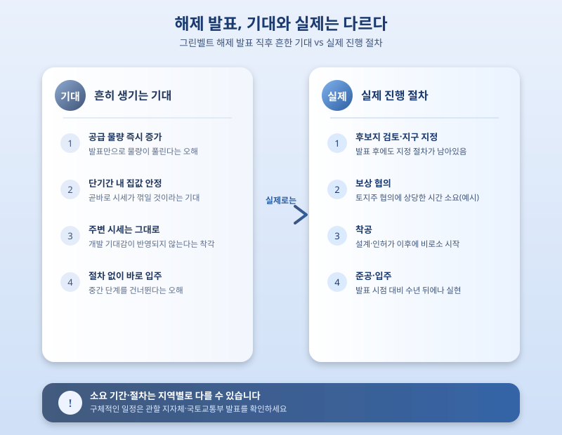

# 그린벨트 해제로 신규 택지 공급 확대, 집값 안정에 효과 있을까

  

정부가 수도권을 중심으로 개발제한구역, 이른바 그린벨트를 추가로 해제해 신규 택지를 공급하는 방안을 검토하고 있다는 소식이 이어지고 있다. 공급 부족이 집값 상승의 주요 원인으로 꾸준히 지목되어 온 만큼, 그린벨트 해제는 굵직한 부동산 대책이 나올 때마다 빠짐없이 등장하는 단골 카드다. 오늘은 그린벨트 해제가 실제로 무엇을 의미하고, 집값 안정에 얼마나 빠르게 기여할 수 있는지 짚어본다.

그린벨트는 도시의 무분별한 팽창을 막고 자연환경을 보전하기 위해 개발을 제한해 둔 구역이다. 정부는 필요에 따라 일부 구역을 해제해 공공주택지구나 신규 택지지구로 개발해 왔고, 최근에도 수도권 주요 지역을 중심으로 추가 해제 후보지가 거론되고 있다. 다만 해제 발표부터 실제 입주까지는 후보지 검토, 지구 지정, 보상 협의, 착공, 준공까지 여러 단계를 거쳐야 하기 때문에 짧아도 수년, 길게는 그 이상의 시간이 걸린다는 점을 먼저 이해할 필요가 있다.

  

이 때문에 그린벨트 해제 소식이 나온다고 해서 당장 시장에 공급 물량이 풀리는 것은 아니다. 오히려 해제 발표 직후에는 개발 기대감으로 인근 지역의 땅값이나 집값이 먼저 들썩이는 경우도 있어, 단기적으로는 가격 안정 효과보다 기대심리를 자극하는 효과가 먼저 나타날 수 있다는 지적도 나온다. 실수요자라면 해제 발표 시점의 분위기에 휩쓸리기보다, 지구 지정 여부와 보상 진행 상황, 분양 일정 등 구체적인 절차가 어디까지 왔는지를 차분히 확인하는 편이 안전하다.

결국 그린벨트 해제는 중장기적인 공급 확대 수단이지, 즉각적인 집값 안정책은 아니라는 점을 이해하고 접근할 필요가 있다. 관심 있는 해제 후보지가 있다면 발표 이후에도 지구 지정, 보상, 분양 일정 등 후속 절차를 꾸준히 살펴보면서, 조급하게 판단하기보다 본인의 주거 계획에 맞춰 장기적인 관점에서 움직이는 것이 바람직하다.

※ 이 초안은 AI가 생성했습니다. 게시 전 수치·정책 내용의 사실관계를 반드시 확인하세요.
