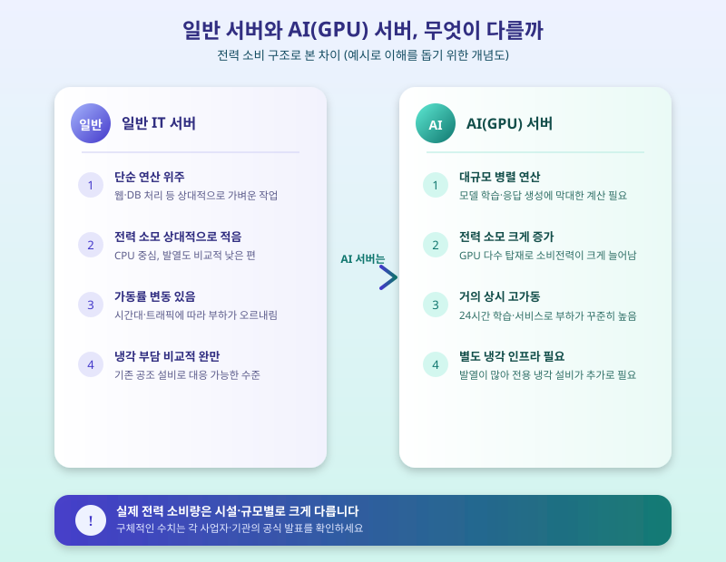

# AI 데이터센터 전력 수요 급증, 우리 생활엔 어떤 영향이 있을까

  

최근 생성형 AI 서비스가 빠르게 확산되면서, 이를 뒷받침하는 데이터센터의 전력 소비량이 국내외에서 큰 화두로 떠오르고 있다. 대형 언어모델을 학습시키고 실시간으로 응답을 생성하는 과정에는 막대한 연산이 필요한데, 이 연산을 처리하는 서버들이 쉬지 않고 돌아가려면 그만큼 많은 전기가 필요하기 때문이다. 오늘은 AI 데이터센터의 전력 수요가 왜 이렇게 빠르게 늘어나고 있는지, 그리고 이것이 우리 일상과 어떤 접점을 갖는지 짚어본다.

AI 서비스에 쓰이는 데이터센터는 일반적인 IT 서버와는 성격이 조금 다르다. 웹사이트 운영이나 데이터베이스 처리처럼 상대적으로 가벼운 작업을 처리하던 기존 서버와 달리, AI 모델은 대규모 병렬 연산을 담당하는 GPU를 다수 탑재한 서버에서 돌아간다. GPU는 CPU보다 훨씬 많은 전력을 소모하는 데다, 모델 학습과 서비스 제공이 거의 24시간 이어지다 보니 가동률 자체가 항상 높은 수준으로 유지된다. 여기에 서버에서 발생하는 열을 식히기 위한 냉각 설비까지 더해지면서, 하나의 대형 AI 데이터센터가 소비하는 전력량이 웬만한 소도시 전체와 맞먹는다는 이야기가 해외에서 종종 나올 정도다.

  

국내에서도 데이터센터 신설 계획이 특정 지역에 몰리는 경우가 늘면서, 그 지역의 전력망이 감당할 수 있는 용량과 송배전 인프라 확충 필요성이 함께 논의되고 있다. 데이터센터 하나가 들어서려면 안정적인 전력 공급이 전제되어야 하는 만큼, 지자체와 전력 당국, 사업자 간의 협의도 갈수록 중요해지는 분위기다. 장기적으로는 이런 수요 증가가 전기요금 체계나 에너지 정책 방향에도 영향을 줄 수 있다는 전망이 나오면서, 산업계와 정부 모두 전력 수급 균형을 어떻게 맞출지 고민을 이어가고 있다.

이용자 입장에서 당장 체감할 만한 변화는 크지 않을 수 있지만, 지금 사용하는 편리한 AI 서비스 이면에는 이렇게 눈에 잘 띄지 않는 전력 인프라 문제가 자리하고 있다는 점은 알아둘 만하다. 앞으로 전기요금 정책이나 지역별 전력 인프라 투자 소식이 나온다면, 그 배경에 AI 데이터센터발 전력 수요 증가가 있을 가능성을 염두에 두고 살펴보면 이해가 한결 쉬워질 것이다.

※ 이 초안은 AI가 생성했습니다. 게시 전 수치·정책 내용의 사실관계를 반드시 확인하세요.
