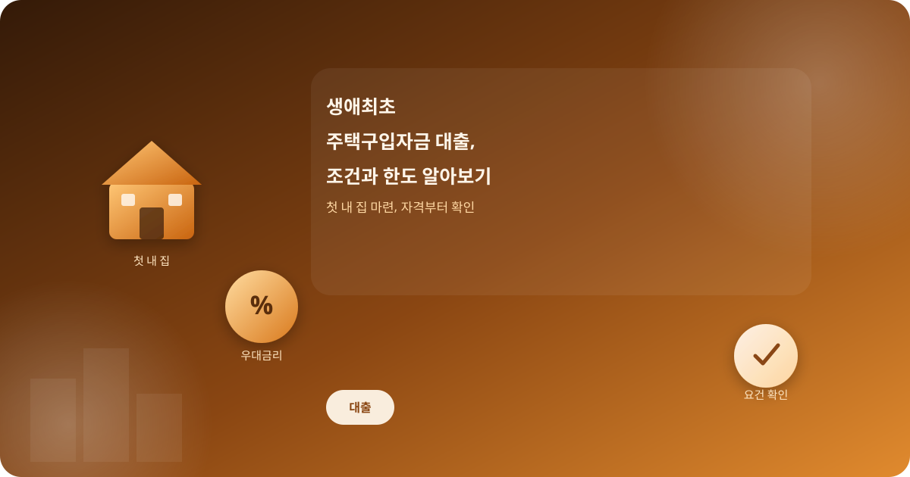
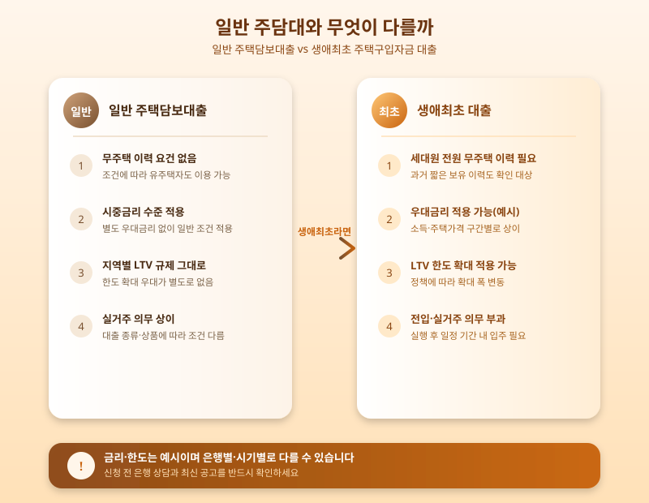

# 생애최초 주택구입자금 대출, 조건과 한도 제대로 알아보기

  

처음으로 내 집을 마련하려는 사람이라면 '생애최초 주택구입자금 대출'이라는 이름을 한 번쯤 들어봤을 것이다. 일반 주택담보대출보다 조건이 까다롭지 않고 금리나 한도 면에서 우대를 받을 수 있어 관심이 높지만, 정작 본인이 대상자인지, 어떤 서류를 준비해야 하는지 정확히 아는 사람은 많지 않다. 오늘은 생애최초 대출을 준비할 때 꼭 확인해야 할 기본적인 내용들을 정리해본다.

생애최초 대출의 첫 번째 관문은 '생애최초'라는 이름에 걸맞게 세대 구성원 전원이 과거에 주택을 소유한 이력이 없어야 한다는 점이다. 본인뿐 아니라 배우자, 함께 등재된 세대원까지 포함되는 경우가 많아, 과거에 짧은 기간이라도 주택을 보유했던 이력이 있다면 대상에서 제외될 수 있다. 또한 소득 요건과 매입하려는 주택의 가격, 면적 기준도 함께 적용되기 때문에, 대출을 알아보기 전에 본인과 가구 구성원 모두의 조건을 먼저 점검하는 것이 순서다.

  

조건을 충족한다면 일반 주택담보대출 대비 금리 우대와 한도 확대 혜택을 받을 수 있다는 점이 가장 큰 장점이다. 다만 우대 조건이 적용되는 소득 구간이나 주택 가격 구간은 정책에 따라 조정될 수 있어, 신청 시점의 최신 공고를 반드시 확인해야 한다. 또한 대출 실행 후 일정 기간 안에 전입해 실거주해야 하는 요건이 붙는 경우가 대부분이므로, 자금 계획뿐 아니라 입주 일정까지 함께 고려해 신청하는 것이 좋다.

생애최초 주택구입자금 대출은 조건만 맞으면 첫 내 집 마련의 부담을 크게 덜어줄 수 있는 제도지만, 세대원 요건이나 소득·주택가격 기준을 놓쳐 뒤늦게 자격이 안 된다는 것을 알게 되는 경우도 적지 않다. 계약을 서두르기보다는 은행 상담과 관련 기관 공고를 통해 본인의 자격 요건과 최신 한도·금리 조건을 미리 확인한 뒤 계획을 세우는 것이 가장 안전한 방법이다.

※ 이 초안은 AI가 생성했습니다. 게시 전 수치·정책 내용의 사실관계를 반드시 확인하세요.
