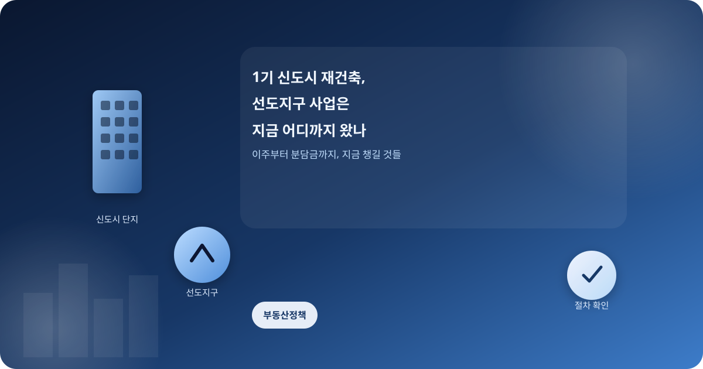
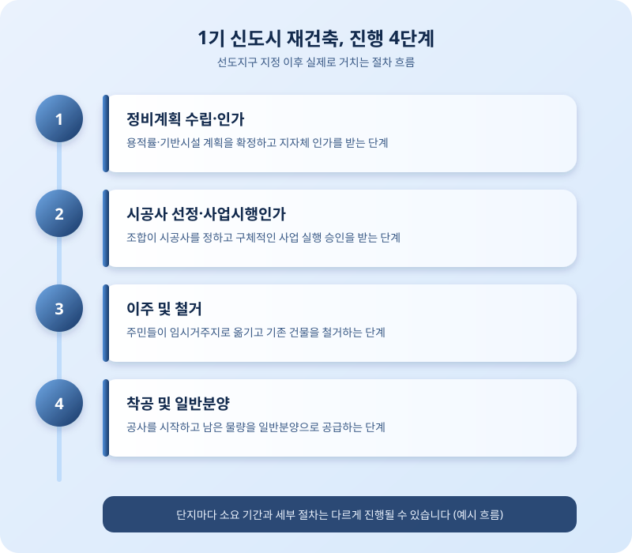

# 1기 신도시 재건축, 선도지구 사업은 지금 어디까지 왔나

  

분당, 일산, 평촌, 산본, 중동 등 1기 신도시의 재건축 이야기가 나온 지도 꽤 시간이 흘렀다. 선도지구로 지정된 단지들을 중심으로 사업이 하나둘 다음 단계로 넘어가고 있다는 소식이 들리면서, 정작 그 안에 사는 주민들은 "우리 단지는 언제쯤 이주를 시작하게 될까"라는 현실적인 질문 앞에 서 있다. 오늘은 1기 신도시 재건축이 실제로 어떤 단계를 거쳐 진행되는지, 지금 시점에서 무엇을 눈여겨봐야 하는지 정리해본다.

1기 신도시 재건축은 노후계획도시 특별법을 근거로, 안전진단 문턱을 낮추고 용적률을 높여주는 대신 공공성을 확보하는 방식으로 설계되어 있다. 선도지구로 뽑힌 단지들은 사업 속도에서 앞서가지만, 그렇다고 곧바로 착공에 들어가는 것은 아니다. 정비계획 수립과 인가, 시공사 선정, 관리처분 같은 일반 재건축과 동일한 절차를 거쳐야 하고, 그 사이사이에 조합원 간 이견이나 사업성 재검토 같은 변수가 얼마든지 끼어들 수 있다.

  

주민들이 가장 예민하게 반응하는 부분은 역시 이주 문제다. 수많은 세대가 한꺼번에 집을 비우고 옮겨가야 하는 만큼, 인근 지역의 전월세 수급에 미치는 영향과 임시거주 공간 확보 여부가 사업 속도를 좌우하는 실질적인 변수로 꼽힌다. 지자체와 조합이 이주 시기를 지역별로 분산시키려는 논의를 이어가고 있는 것도 이 때문이다.

용적률 완화로 사업성이 높아진 것은 사실이지만, 공사비 상승과 분담금 부담은 여전히 조합원들의 최대 고민거리다. 일반분양 물량을 얼마나 확보할 수 있는지, 분담금이 예상보다 얼마나 늘어날 수 있는지는 단지마다 조건이 크게 달라 일률적으로 판단하기 어렵다. 따라서 해당 단지의 정비계획 공람 내용과 조합 설명회 자료를 직접 확인하는 것이 무엇보다 중요하다.

1기 신도시 재건축은 이제 막 본궤도에 오르기 시작한 장기 프로젝트에 가깝다. 선도지구 지정만으로 사업이 순조롭게 끝난다고 단정하기보다는, 이주 계획과 분담금 규모, 시공사 선정 과정 등 단계마다 달라지는 변수를 꾸준히 챙겨보는 자세가 필요하다. 해당 단지에 거주하거나 매수를 고려 중이라면, 조합과 지자체가 내놓는 공식 공고를 통해 최신 진행 상황을 직접 확인하는 것이 가장 확실한 방법이다.

※ 이 초안은 AI가 생성했습니다. 게시 전 수치·정책 내용의 사실관계를 반드시 확인하세요.
