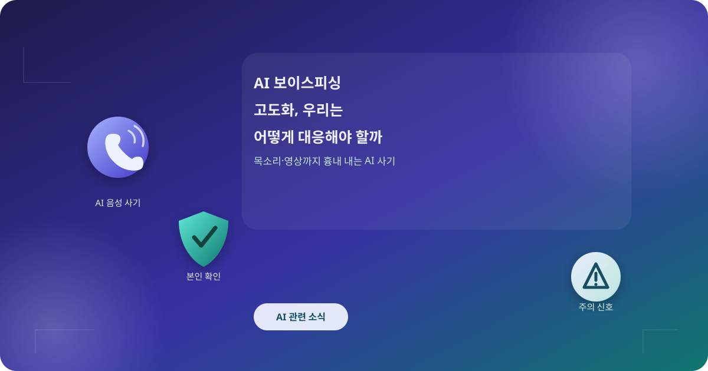
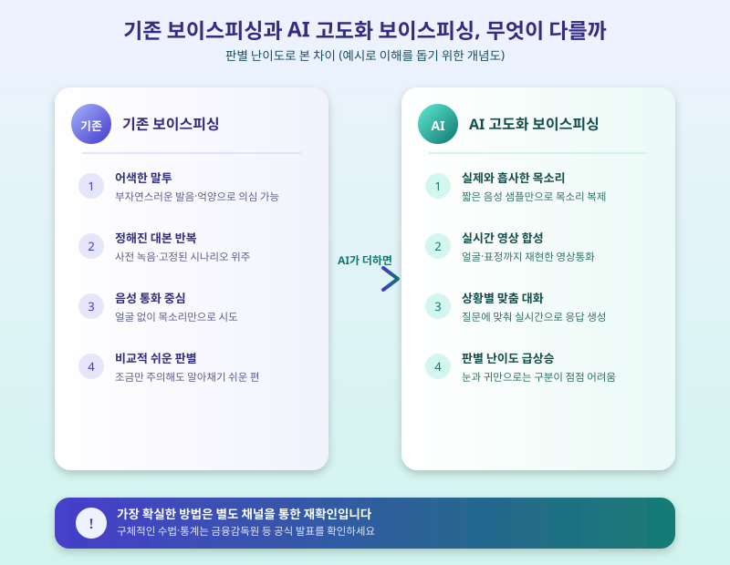

# AI 보이스피싱 고도화, 우리는 어떻게 대응해야 할까

  

며칠 전만 해도 보이스피싱은 어색한 말투와 뻔한 각본으로 어느 정도 걸러낼 수 있는 사기였다. 그런데 최근에는 생성형 AI가 목소리와 영상을 정교하게 흉내 내면서 상황이 달라지고 있다. 가족의 목소리로 걸려 오는 전화, 실제 인물처럼 움직이는 영상통화 속 얼굴까지 등장하면서, "설마 내가 속을까"라는 자신감이 더 이상 안전판이 되지 못하는 시대가 온 것이다. 오늘은 AI로 고도화된 보이스피싱이 어떤 방식으로 이루어지는지, 그리고 개인과 금융권은 각각 어떻게 대응하고 있는지 정리해본다.

AI 음성 합성 기술은 짧은 통화 녹음이나 SNS 영상 몇 초만으로도 특정인의 목소리를 그럴듯하게 재현할 수 있는 수준까지 왔다. 여기에 실시간 영상 합성 기술이 더해지면서, 가족이나 지인을 사칭한 영상통화로 다급한 상황을 연출해 송금을 유도하는 사례도 보고되고 있다. 과거처럼 어눌한 말투나 뜬금없는 요구로 의심할 여지가 줄어든 만큼, 피해자 입장에서는 판단할 시간 자체가 짧아진다는 점이 가장 큰 위협 요인으로 꼽힌다.

  

이에 맞서 금융권도 대응 수준을 높이고 있다. 이상 거래를 실시간으로 감지하는 AI 탐지 시스템을 고도화하고, 큰 금액을 이체할 때는 추가 본인확인 절차를 거치도록 하는 등 다중 인증 체계를 강화하는 추세다. 일부 기관에서는 영상통화 인증 자체도 위조될 수 있다는 전제 아래, 사전에 등록한 질문이나 별도 채널을 통한 재확인 절차를 도입하는 방안도 논의되고 있다.

다만 기술적 방어만으로는 한계가 있는 만큼, 개인 차원의 습관이 여전히 가장 중요하다. 다급한 상황을 이유로 송금이나 개인정보를 요구받으면 일단 전화를 끊고, 알고 있던 번호나 다른 연락 수단으로 직접 확인하는 습관이 필요하다. 가족끼리 미리 정해둔 암구호를 활용하거나, 공식 앱이나 고객센터를 통해 사실 여부를 재확인하는 것도 좋은 방법이다. 무엇보다 "지금 당장", "비밀리에" 처리해야 한다는 압박이 느껴진다면 그 자체를 의심 신호로 받아들이는 자세가 필요하다.

AI 기술이 발전할수록 이를 악용하는 수법도 함께 정교해질 수밖에 없다. 완벽한 방어책은 없지만, 낯선 다급함 앞에서 한 번 더 확인하는 습관과 금융권의 인증 체계 강화가 맞물릴 때 피해를 줄일 수 있다. 평소 가족과 대응 방법을 미리 이야기해두고, 의심스러운 연락을 받으면 주저하지 말고 관련 기관에 신고하는 것이 가장 확실한 대비책이다.

※ 이 초안은 AI가 생성했습니다. 게시 전 수치·정책 내용의 사실관계를 반드시 확인하세요.
