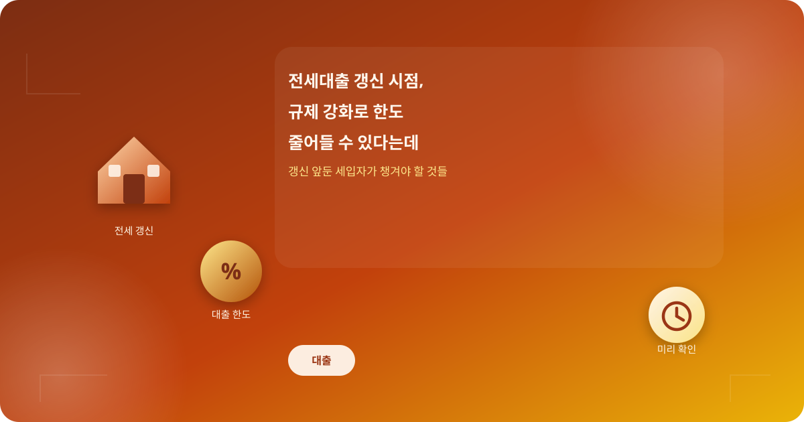
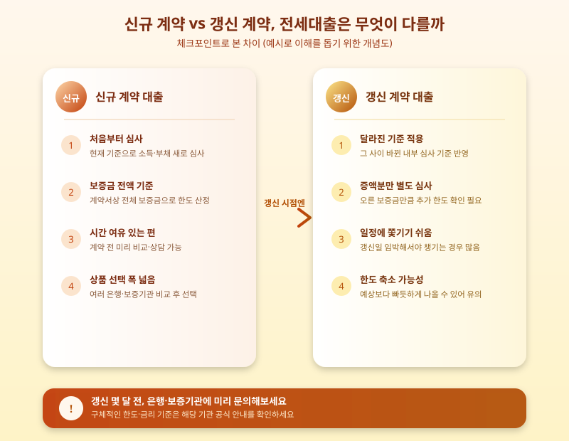

# 전세대출 갱신 시점, 규제 강화로 한도 줄어들 수 있다는데

  

전세 계약 갱신을 앞둔 세입자라면 최근 심상치 않은 소식에 촉각을 세우고 있을 것이다. 가계대출 관리 기조가 이어지면서 전세자금대출에 대한 심사와 한도 산정 방식도 점점 까다로워지고 있다는 이야기가 나온다. 신규 계약자만의 문제가 아니라, 이미 살고 있던 집의 계약을 갱신하는 세입자들도 예상치 못하게 대출 한도가 줄어드는 상황을 마주할 수 있다는 점에서 미리 짚어볼 필요가 있다.

전세자금대출은 그동안 상대적으로 문턱이 낮은 편이었지만, 최근에는 소득 대비 부채 수준을 더 꼼꼼히 들여다보는 쪽으로 심사 기준이 조정되는 분위기다. 특히 갱신 시점에는 처음 대출을 받았을 때와 달리 그 사이 금융기관의 내부 기준이나 보증기관의 한도 산정 방식이 바뀌어 있을 수 있어, "예전과 같겠지"라고 생각했다가 당황하는 사례가 나올 수 있다. 신규 계약과 갱신 계약에 적용되는 기준이 조금씩 다르게 움직일 수 있다는 점도 미리 알아두면 좋다.

  

한도나 금리에 영향을 줄 수 있는 요소로는 소득 변화, 기존 대출 보유 여부, 보증기관별 심사 방침 차이 등이 꼽힌다. 특히 갱신 시점에 전세보증금이 오른 경우라면 늘어난 금액만큼 추가로 대출을 받을 수 있을지가 관건인데, 이 부분에서 한도가 예상보다 빠듯하게 나오는 경우가 종종 있다고 한다. 따라서 갱신 계약을 앞두고 있다면 계약일보다 여유 있게 은행이나 보증기관에 문의해 현재 적용되는 기준과 예상 한도를 미리 확인해보는 것이 안전하다.

결국 중요한 것은 "갱신이니까 문제없겠지"라는 안일한 생각을 버리고, 계약 갱신 몇 달 전부터 미리 움직이는 자세다. 집주인과의 갱신 협의 일정, 대출 한도 조회, 필요하다면 대안 상품 비교까지 시간을 두고 준비한다면 급하게 자금을 마련해야 하는 상황을 피할 수 있다. 전세대출 관련 정책은 앞으로도 계속 조정될 가능성이 크므로, 계약 갱신을 앞둔 세입자라면 관련 소식을 주기적으로 확인하는 습관을 들이는 것이 좋겠다.

※ 이 초안은 AI가 생성했습니다. 게시 전 수치·정책 내용의 사실관계를 반드시 확인하세요.
