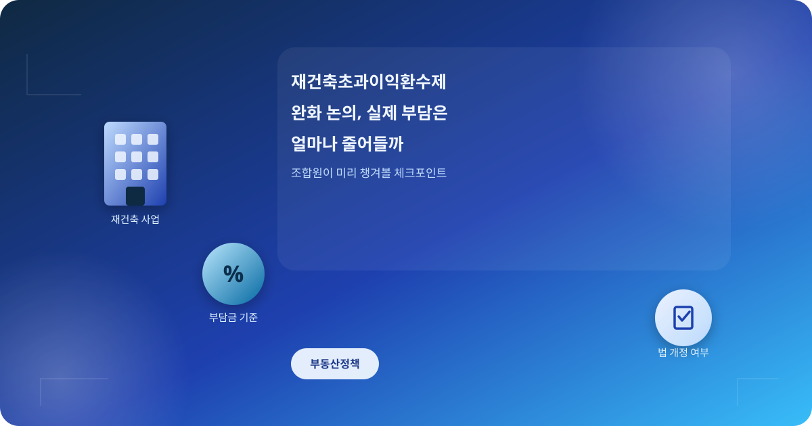
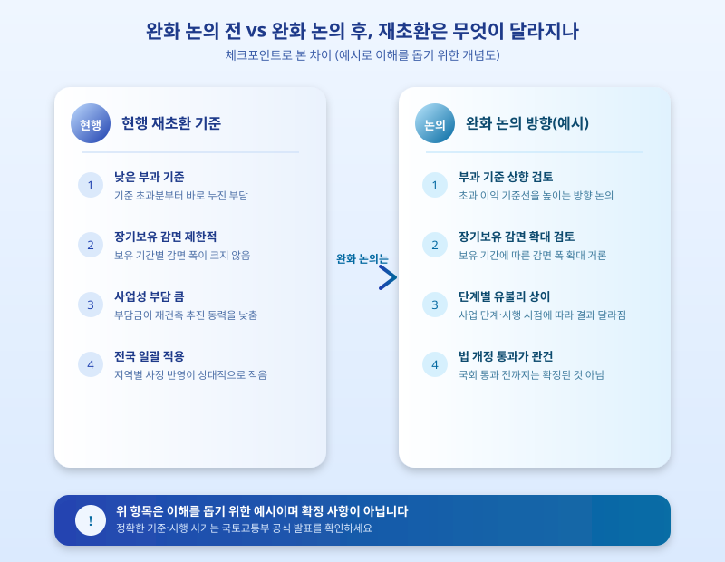

# 재건축초과이익환수제 완화 논의, 실제 부담은 얼마나 줄어들까

  

최근 재건축 사업을 추진 중인 단지들 사이에서 재건축초과이익환수제, 이른바 '재초환' 완화 논의가 다시 주목받고 있다. 사업성 저하로 재건축 추진에 어려움을 겪는 단지가 늘어나면서, 부과 기준과 면제 범위를 손보려는 움직임이 이어지는 분위기다. 조합원 입장에서는 실제 부담금이 얼마나 줄어들지가 가장 궁금한 부분일 텐데, 아직 확정된 내용이 아닌 만큼 논의 흐름을 차분히 짚어볼 필요가 있다.

재초환은 재건축으로 얻은 초과 이익이 일정 수준을 넘으면 그 일부를 국가에 환수하는 제도로, 조합원 1인당 평균 이익이 기준을 넘어서면 누진적으로 부담금이 커지는 구조다. 이번에 논의되는 완화 방안은 부과 기준 금액을 높이거나 장기보유자에 대한 감면 폭을 넓히는 방향이 거론되는데, 구체적인 수치나 시행 시기는 아직 논의 단계에 머물러 있다. 특히 재건축 초기 단계인 단지와 이미 관리처분인가를 받은 단지 사이에서는 적용 시점에 따라 유불리가 갈릴 수 있어, 조합별로 셈법이 달라질 가능성이 크다.

  

조합원 입장에서 중요한 것은 완화 논의가 나온다고 해서 곧바로 부담금이 줄어드는 것은 아니라는 점이다. 관련 법 개정이 국회를 통과해야 실제 적용이 가능하고, 그 과정에서 완화 폭이 애초 논의보다 축소되거나 시행 시기가 늦춰질 가능성도 배제할 수 없다. 따라서 재건축을 추진 중인 조합이라면 언론 보도만 보고 성급하게 사업 계획을 조정하기보다, 조합 총회나 공식 안내를 통해 최신 진행 상황을 확인하는 것이 안전하다.

결국 재초환 완화는 재건축 사업성에 직접 영향을 미치는 만큼 계속 지켜볼 가치가 있는 사안이다. 다만 법 개정 전까지는 어디까지나 논의 단계라는 점을 염두에 두고, 정확한 부과 기준과 시행 시기는 국토교통부나 관할 지자체의 공식 발표를 통해 확인하는 습관을 들이는 것이 좋겠다. 조합원이라면 소속 조합의 안내와 전문가 상담을 병행해 자신의 상황에 맞는 정보를 챙기는 것이 가장 확실한 방법이다.

※ 이 초안은 AI가 생성했습니다. 게시 전 수치·정책 내용의 사실관계를 반드시 확인하세요.
