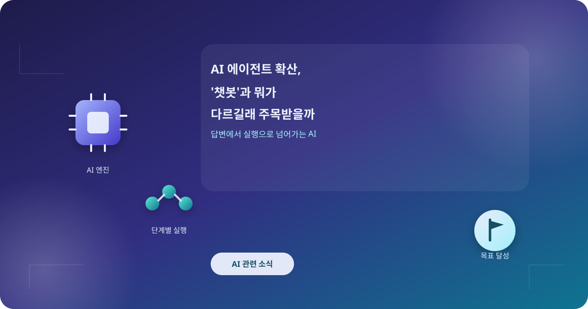
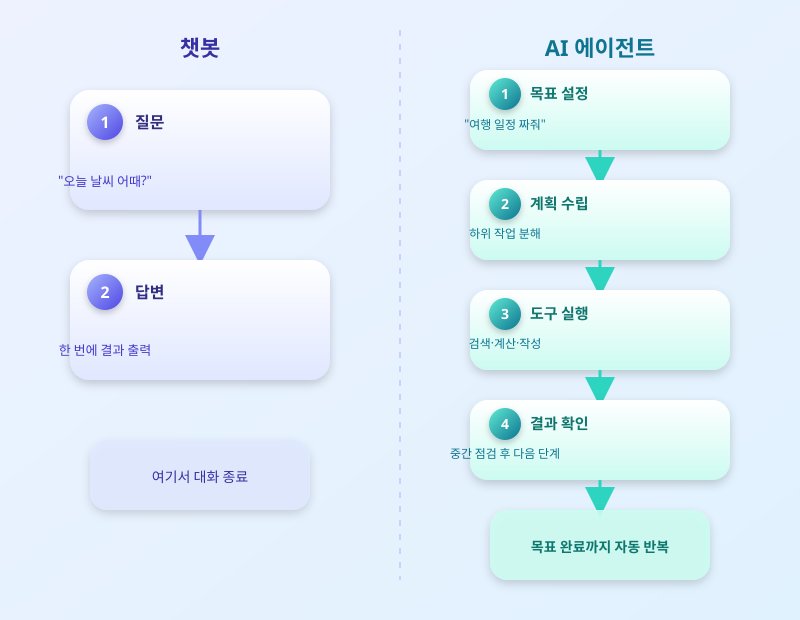

# AI 에이전트 확산, '챗봇'과 뭐가 다르길래 주목받을까

  

얼마 전까지만 해도 AI라고 하면 질문을 던지고 답을 받는 챗봇을 떠올리는 경우가 많았다. 그런데 최근에는 한 걸음 더 나아가, 사용자가 목표만 던져주면 여러 단계를 스스로 계획하고 실행까지 처리하는 'AI 에이전트'가 빠르게 확산되고 있다. 일정 조율부터 자료 조사, 코드 작성, 간단한 업무 자동화까지 손대는 영역이 넓어지면서, 챗봇과 정확히 무엇이 다른지, 실제로 얼마나 믿고 맡길 수 있는지에 대한 관심이 커지는 시점이다.

챗봇과 AI 에이전트의 가장 큰 차이는 '한 번의 답변'과 '여러 단계의 실행'에 있다. 챗봇은 질문 하나에 답 하나를 내놓고 끝나지만, 에이전트는 목표를 이루기 위해 필요한 하위 작업을 스스로 나누고, 순서를 정하고, 중간 결과를 확인하면서 다음 단계로 넘어간다. 필요하면 검색이나 계산, 문서 작성 같은 외부 도구를 직접 호출하기도 한다. 즉 사람이 매 단계 지시를 내리지 않아도, 에이전트가 스스로 판단하며 작업을 이어간다는 점이 핵심이다.

  

실제 활용 사례도 빠르게 늘고 있다. 회의 일정을 조율하고 관련 자료를 정리해 요약본까지 만들어주는 업무 보조, 반복적인 데이터 정리나 보고서 초안 작성을 대신 처리하는 사무 자동화, 코드 오류를 스스로 찾아 수정안을 제시하는 개발 보조 등이 대표적이다. 사람이 일일이 지시하던 작업의 상당 부분을 에이전트에게 맡기면서, 업무 방식 자체가 조금씩 달라지고 있는 셈이다.

다만 편리함만큼 주의할 점도 분명하다. 에이전트가 스스로 판단해 실행하는 만큼, 잘못된 정보를 바탕으로 엉뚱한 결론을 내리거나 권한 범위를 벗어난 작업을 시도할 가능성도 함께 커진다. 따라서 중요한 작업일수록 에이전트에게 부여하는 권한 범위를 명확히 하고, 중간 결과를 사람이 한 번씩 확인하는 절차를 두는 것이 안전하다. 앞으로 AI 에이전트가 일상 업무에 더 깊숙이 들어올수록, 얼마나 잘 활용하느냐 못지않게 얼마나 안전하게 통제하느냐가 함께 중요해질 전망이다.

※ 이 초안은 AI가 생성했습니다. 게시 전 수치·정책 내용의 사실관계를 반드시 확인하세요.
