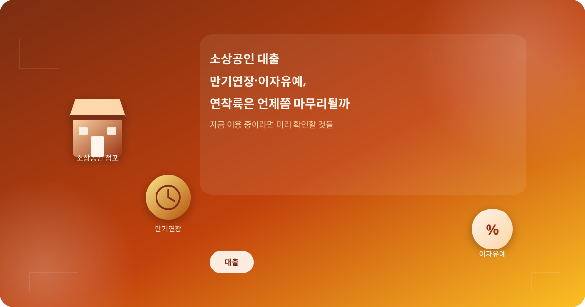
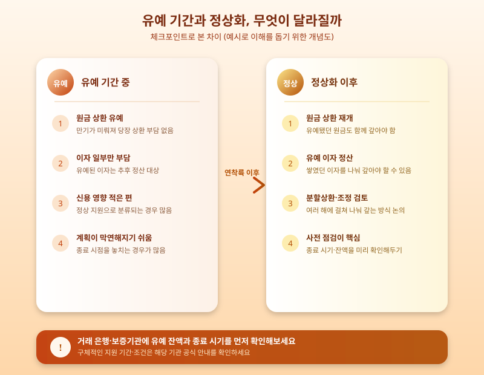

# 소상공인 대출 만기연장·이자유예, 연착륙은 언제쯤 마무리될까

  

코로나19로 매출이 급감했던 시기, 많은 자영업자와 소상공인들이 대출 만기연장과 이자상환유예 지원을 받으며 급한 불을 껐다. 시간이 꽤 흘렀지만 이 지원은 완전히 끝나지 않고 몇 차례 연장과 조건 조정을 거치며 이어져 왔다. 최근에도 지원을 언제까지, 어떤 방식으로 정상화할지를 둘러싼 논의가 계속되면서, 아직 이 제도를 이용 중인 사장님들 사이에서는 "우리 가게는 앞으로 어떻게 되는 거지"라는 궁금증이 커지고 있다.

이 지원 제도의 핵심은 상환을 미뤄주는 것이지 빚을 없애주는 것이 아니라는 점이다. 만기연장은 원금 상환 시점을 뒤로 늦춰주는 조치이고, 이자상환유예는 이자 납부 부담을 일정 기간 줄여주는 조치인데, 두 경우 모두 유예된 금액이 사라지는 것이 아니라 나중에 정산해야 하는 구조다. 그래서 지원이 길어질수록 당장의 숨통은 트이지만, 정상화 시점이 왔을 때 한꺼번에 갚아야 할 부담도 함께 쌓일 수 있다는 점을 놓치지 말아야 한다.

  

이 때문에 최근 논의의 방향은 지원을 한 번에 끊는 대신, 상환 부담을 여러 해에 걸쳐 나누어 갚도록 하거나 개인별 상황에 맞는 채무조정 절차를 함께 안내하는 '연착륙' 쪽에 무게가 실리고 있다. 갑작스러운 상환 요구로 폐업이 잇따르는 상황을 막으면서도, 지원을 무한정 이어가기는 어렵다는 재정 부담 사이에서 균형을 찾으려는 시도로 볼 수 있다.

지금 이 제도를 이용 중이라면, 막연히 다음 연장 소식을 기다리기보다 본인의 유예 잔액과 향후 상환 일정을 미리 확인해두는 것이 좋다. 거래 은행이나 신용보증기금, 소상공인시장진흥공단 등을 통해 현재 적용받고 있는 지원 유형과 종료 예정 시기를 점검하고, 분할상환이나 채무조정 같은 대안이 본인에게 유리한지도 함께 상담받아 볼 필요가 있다. 지원이 끝나는 순간 당황하지 않으려면, 지금부터 상환 계획을 조금씩 그려두는 준비가 무엇보다 중요하다.

※ 이 초안은 AI가 생성했습니다. 게시 전 수치·정책 내용의 사실관계를 반드시 확인하세요.
