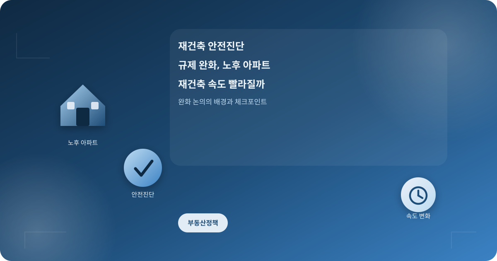
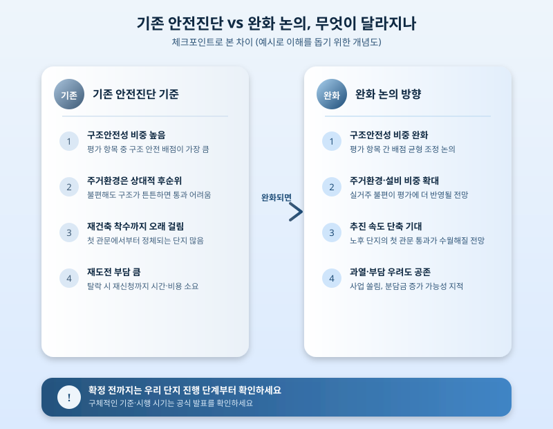

# 재건축 안전진단 규제 완화, 노후 아파트 재건축 속도 빨라질까

  

준공된 지 30년 안팎 된 아파트가 전국 곳곳에서 빠르게 늘고 있다. 이런 단지들이 재건축을 추진하려면 가장 먼저 넘어야 할 관문이 바로 안전진단이다. 그런데 그동안 이 안전진단 문턱이 지나치게 높아 정작 재건축이 필요한 노후 단지들이 첫 단계부터 발이 묶인다는 지적이 꾸준히 나왔고, 최근에도 이 기준을 손보려는 논의가 이어지면서 관련 단지 주민들의 관심이 다시 높아지고 있다.

안전진단은 구조적으로 얼마나 노후화됐는지, 그대로 두어도 안전한지를 평가해 재건축 여부를 판단하는 절차다. 문제는 이 평가에서 '구조안전성' 항목이 차지하는 비중이 커서, 겉으로 보기엔 낡고 불편한 단지라도 구조적으로 당장 위험하지 않다고 판정되면 재건축 자체가 막혀버리는 경우가 많았다는 점이다. 이 때문에 주차난이나 배관 노후화처럼 실제 거주 불편이 큰 요소보다 구조 안전성이 지나치게 좌우하는 현재 방식을 손질해야 한다는 목소리가 커져 왔다.

  

최근 논의되는 완화 방향은 구조안전성 비중을 낮추고 주거환경이나 설비 노후도 같은 항목의 비중을 높여, 실질적으로 살기 불편한 단지가 안전진단을 좀 더 수월하게 통과하도록 하는 데 초점이 맞춰져 있다. 절차가 빨라지면 정비가 시급한 노후 단지의 재건축 착수 속도는 분명 빨라질 수 있지만, 동시에 무분별한 재건축 추진으로 특정 지역에 사업이 몰리거나 공사비·분담금 부담이 예상보다 커질 수 있다는 우려도 함께 나온다.

재건축을 염두에 두고 있는 단지 주민이라면 완화 논의의 세부 내용이 확정되기를 기다리는 동시에, 우리 단지가 현재 어떤 평가 단계에 있는지, 조합 설립이나 추진위원회 구성은 어느 정도 진행됐는지를 미리 점검해두는 것이 좋다. 기준이 바뀌더라도 결국 단지별 여건과 절차 진행 속도에 따라 실제 체감 시기는 크게 달라질 수 있는 만큼, 막연히 기대하기보다는 관리사무소나 정비사업 조합을 통해 정확한 진행 상황을 확인해보는 것이 현실적인 대응이다.

※ 이 초안은 AI가 생성했습니다. 게시 전 수치·정책 내용의 사실관계를 반드시 확인하세요.
