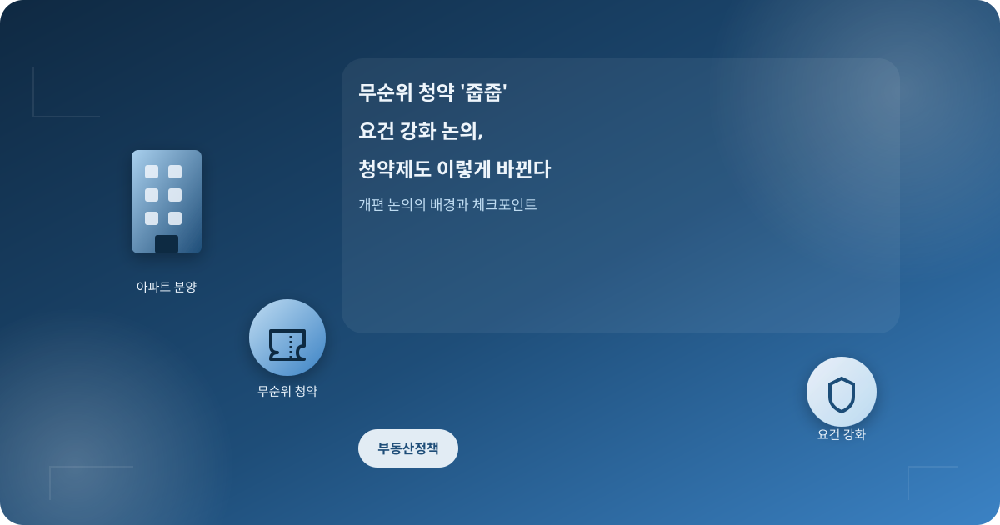
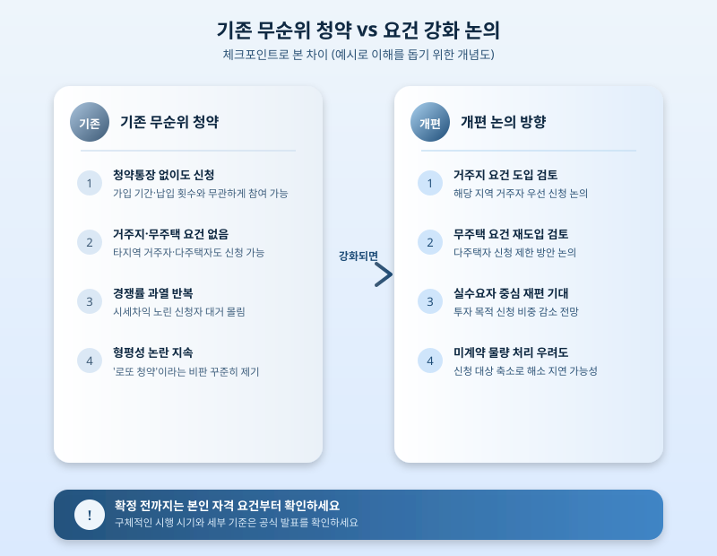

# 무순위 청약 '줍줍' 요건 강화 논의, 청약제도 이렇게 바뀐다

  

무순위 청약, 소위 '줍줍'은 아파트 분양 과정에서 계약이 취소되거나 미달된 물량을 대상으로 청약통장 없이도, 무주택 여부나 거주지와 무관하게 신청할 수 있어 그동안 큰 관심을 받아왔다. 하지만 당첨만 되면 시세보다 낮은 분양가로 내 집을 마련할 수 있다는 점 때문에 다주택자까지 대거 몰려드는 '로또 청약' 논란이 계속되면서, 관련 요건을 손보려는 논의가 이어지고 있다.

무순위 청약은 원래 미계약 물량을 신속하게 처리하기 위해 도입된 제도다. 그런데 자격 제한이 사실상 없다시피 하다 보니 실거주 목적보다 시세차익을 노린 신청자가 대거 몰려 청약 경쟁률이 지나치게 치솟는 과열 양상이 반복된다는 지적이 꾸준히 나왔다. 이 때문에 해당 지역 거주자로 신청 자격을 제한하거나, 한동안 사라졌던 무주택 요건을 다시 도입하는 방향의 개편 논의가 계속되고 있다.

  

요건이 강화되면 청약 기회가 실수요자 중심으로 재편될 것이라는 기대가 나온다. 다만 신청 가능한 대상 자체가 줄어들면서 미계약 물량 해소 속도가 오히려 늦어지거나, 경쟁률이 낮아져 건설사의 자금 회수 부담이 커질 수 있다는 우려도 함께 제기된다. 지역별로 시장 상황과 미분양 여건이 다른 만큼, 전국에 일률적인 요건을 적용하기보다 단계적으로 접근해야 한다는 목소리도 나온다.

청약을 준비하고 있다면 개편 논의의 세부 내용이 확정되기 전까지, 본인의 청약통장 가입 기간과 납입 횟수, 무주택 요건, 거주지 요건 등을 미리 정리해두는 것이 좋다. 제도가 바뀌더라도 결국 개인의 자격 요건이 당첨 가능성을 좌우하는 만큼, 막연히 기다리기보다는 청약홈 등 공식 채널을 통해 정확한 자격 조건과 일정을 미리 확인해보는 것이 현실적인 대응이다.

※ 이 초안은 AI가 생성했습니다. 게시 전 수치·정책 내용의 사실관계를 반드시 확인하세요.
