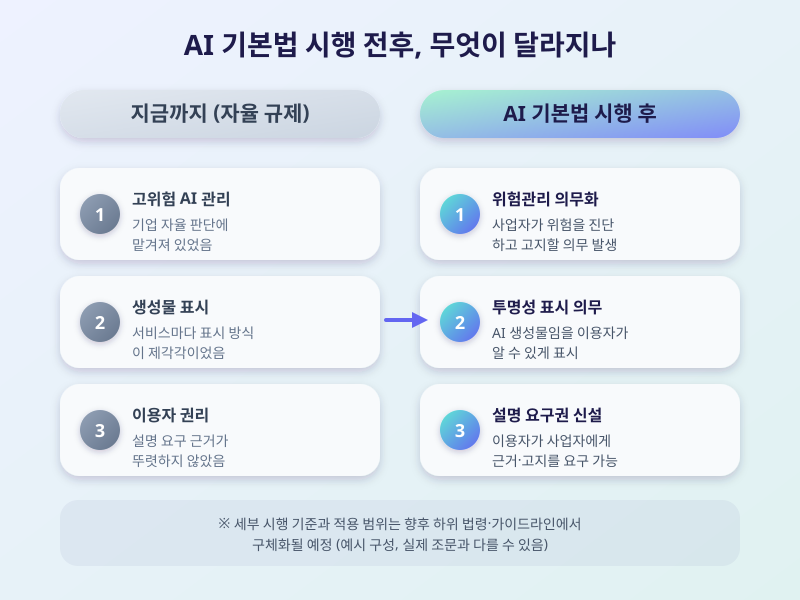

# AI 기본법 시행, 기업과 이용자가 지금 챙겨야 할 것들

  

인공지능 기술이 우리 일상 깊숙이 들어오면서, 이를 규율할 법적 기반을 마련하기 위한 AI 기본법이 본격적으로 적용되는 국면에 접어들었다. 그동안 자율 규제 중심으로 흘러오던 국내 AI 산업에 처음으로 명확한 법적 틀이 생기는 만큼, 서비스를 만드는 기업과 이를 이용하는 사람 모두 어떤 변화가 있는지 미리 짚어볼 필요가 있다.

AI 기본법의 핵심은 크게 두 가지로 요약할 수 있다. 하나는 사람의 생명이나 안전, 기본권에 큰 영향을 줄 수 있는 이른바 '고위험 AI' 영역에 대해 사업자가 위험을 진단하고 관리하며 이용자에게 관련 사실을 고지하도록 하는 의무이고, 다른 하나는 생성형 AI가 만든 결과물임을 이용자가 알 수 있도록 표시하게 하는 투명성 규정이다. 지금까지는 기업 자율에 맡겨져 있던 부분들이 법적 의무로 바뀌는 셈이다.

  

이용자 입장에서 체감할 수 있는 변화도 있다. 챗봇 상담이나 이미지·영상 생성 서비스를 이용할 때 해당 결과물이 AI로 만들어졌다는 표시를 더 자주 보게 될 가능성이 크고, 서비스 제공자에게 관련 고지나 설명을 요구할 수 있는 근거도 마련된다. 기업 입장에서는 자사 서비스가 고위험 영역에 해당하는지 먼저 점검하고, 내부적으로 위험관리 체계와 문서화 절차를 준비해야 하는 부담이 새로 생긴다.

제도가 자리 잡기까지는 시행 초기의 혼란과 세부 지침을 둘러싼 추가 논의가 한동안 이어질 것으로 보인다. 스타트업 등 규모가 작은 사업자에게는 규제 부담이 과도하지 않도록 하는 보완책 논의도 함께 진행되고 있다. AI 서비스를 만드는 입장이든 이용하는 입장이든, 지금은 법의 큰 틀을 이해하고 앞으로 나올 세부 가이드라인을 주의 깊게 지켜봐야 할 시점이다.

※ 이 초안은 AI가 생성했습니다. 게시 전 수치·정책 내용의 사실관계를 반드시 확인하세요.
