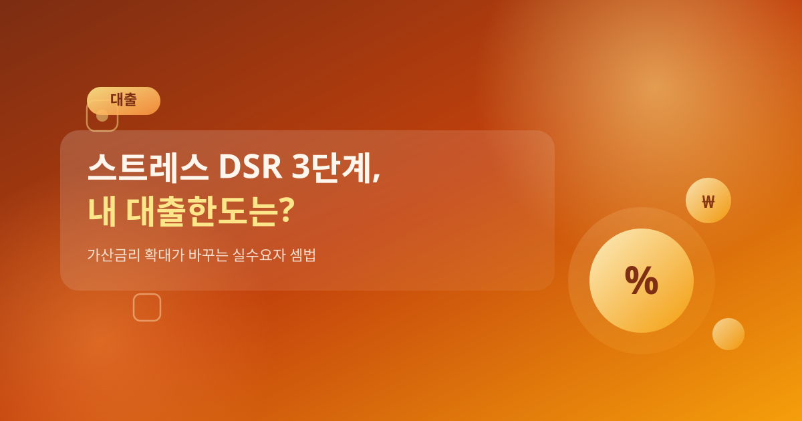
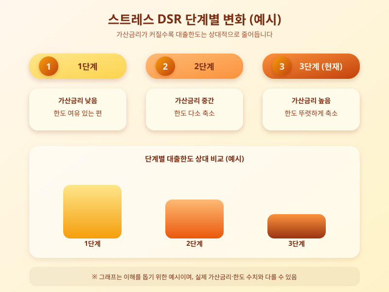

# 스트레스 DSR 3단계 시행, 내 대출한도는 얼마나 줄어드나

  

최근 대출 상담을 받아본 사람이라면 예전보다 한도가 빠듯하게 나온다는 이야기를 한 번쯤 들어봤을 것이다. 가계부채 증가 속도를 억제하기 위해 도입된 스트레스 DSR 제도가 단계적으로 강화되면서, 특히 변동금리형 주택담보대출을 이용하려는 실수요자들의 체감 한도가 눈에 띄게 줄어들고 있다. 앞으로 적용 범위가 더 확대될 예정인 만큼, 지금 시점에서 제도의 핵심을 짚어볼 필요가 있다.

스트레스 DSR은 실제 적용 금리에 일정한 가산금리, 즉 스트레스 금리를 더해 상환능력을 심사하는 방식이다. 금리가 오를 가능성까지 미리 반영해 대출자가 감당할 수 있는 원리금 상환 부담을 보수적으로 계산하겠다는 취지다. 문제는 이 가산금리가 단계적으로 높아지도록 설계돼 있다는 점이다. 초기 단계에서는 상대적으로 낮은 가산금리가 적용됐지만, 단계가 올라갈수록 반영 비율이 커지면서 동일한 소득과 조건이라도 받을 수 있는 대출한도가 이전보다 줄어드는 결과로 이어진다.

  

특히 변동금리나 준고정형 대출처럼 금리 변동 위험이 큰 상품일수록 가산금리가 더 크게 반영되기 때문에, 상대적으로 고정금리 상품과의 한도 격차가 벌어지는 구조다. 이 때문에 금융권에서는 대출자들이 고정금리 상품으로 갈아타거나, 애초에 상품을 고를 때부터 스트레스 DSR 적용 결과를 미리 확인하는 사례가 늘고 있다고 전한다. 지역별로 적용 강도가 다르게 설계된 부분도 있어, 거주 지역과 대출 목적에 따라 실제 체감되는 한도 축소 폭은 차이가 날 수 있다.

내 집 마련이나 이사를 앞두고 대출을 계획 중이라면, 단순히 금리 수준만 볼 게 아니라 스트레스 DSR 적용 이후 실제로 받을 수 있는 한도가 얼마인지부터 금융사를 통해 미리 확인해보는 것이 좋다. 제도가 단계적으로 강화되는 흐름인 만큼, 여유 있게 자금 계획을 세우고 여러 금융사의 조건을 비교해보는 준비가 그 어느 때보다 필요한 시점이다.

※ 이 초안은 AI가 생성했습니다. 게시 전 수치·정책 내용의 사실관계를 반드시 확인하세요.
