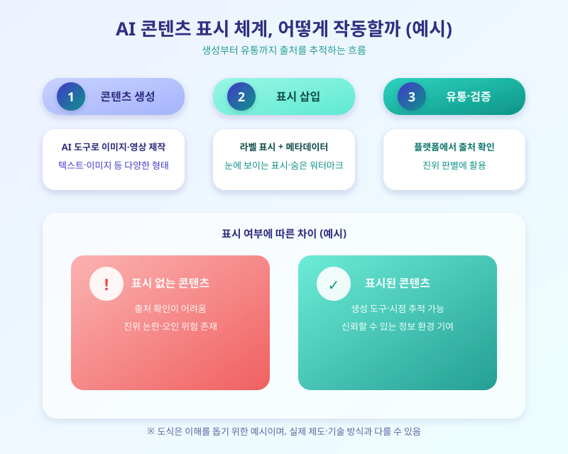

# 딥페이크·AI 생성물 워터마크 의무화, 왜 지금 논의가 빨라질까

  

최근 온라인에서 실제 사람인지 AI가 만든 콘텐츠인지 구분하기 어려운 이미지와 영상이 빠르게 늘고 있다. 유명인의 얼굴을 합성한 딥페이크 영상이나 그럴듯한 가짜 이미지가 확산되면서 사회적 우려가 커지자, 국내외에서 AI로 생성한 콘텐츠에 표시를 의무화하려는 논의가 다시 속도를 내고 있다. 기술이 발전할수록 진위를 가리기가 더 어려워지는 만큼, 지금이야말로 이 논의의 흐름을 짚어볼 시점이다.

현재 거론되는 방식은 크게 두 가지다. 하나는 화면에 'AI 생성' 표시를 눈에 띄게 넣는 방식이고, 다른 하나는 눈에 보이지 않는 워터마크나 메타데이터를 파일에 심어 나중에 진위를 검증할 수 있게 하는 방식이다. 후자는 이미지나 영상이 어떤 도구로, 언제 만들어졌는지를 추적할 수 있는 '콘텐츠 출처 인증' 개념과 맞닿아 있어, 플랫폼 기업들 사이에서도 공통 표준을 만들려는 움직임이 이어지고 있다.

  

해외에서는 이미 AI 생성 콘텐츠에 대한 표시 의무를 법제화하려는 움직임이 앞서 나가고 있고, 국내에서도 관련 논의가 점차 구체화되는 분위기다. 다만 표시를 의무화하더라도 워터마크를 손쉽게 지우거나 우회하는 기술이 함께 발전하고 있어, 제도만으로 문제를 완전히 막기는 어렵다는 지적도 나온다. 그만큼 기술적 검증 수단과 제도적 장치가 함께 발전해야 한다는 목소리가 크다.

콘텐츠 제작자나 기업 입장에서는 앞으로 AI 생성물을 다룰 때 출처 표시나 워터마크 삽입 절차를 미리 점검해두는 것이 좋다. 일반 이용자 역시 온라인에서 접하는 이미지나 영상을 접할 때 한 번 더 출처를 의심해보는 습관이 필요한 시점이다. 제도가 자리 잡기까지는 시간이 걸리겠지만, 신뢰할 수 있는 정보 환경을 만들기 위한 첫걸음이라는 점에서 이 논의를 눈여겨볼 만하다.

※ 이 초안은 AI가 생성했습니다. 게시 전 수치·정책 내용의 사실관계를 반드시 확인하세요.
