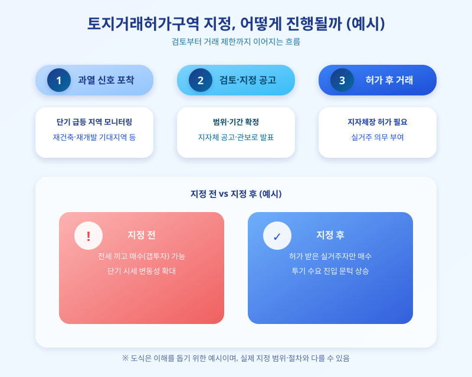

# 토지거래허가구역 재지정 논란, 이번엔 어디까지 넓어질까

  

서울 주요 지역을 중심으로 아파트값 상승세가 다시 꿈틀거리자, 정부와 지방자치단체가 토지거래허가구역을 확대 재지정하는 방안을 다시 검토하고 있다는 소식이 잇따르고 있다. 특정 지역의 집값이 짧은 기간에 크게 오르면 어김없이 등장하는 규제 카드인 만큼, 이번에는 어느 지역까지 대상이 넓어질지, 실거주자와 투자 수요에는 어떤 영향을 줄지 관심이 쏠린다.

토지거래허가구역은 부동산 투기를 막기 위해 특정 지역에서 일정 면적 이상의 토지나 주택을 사고팔 때 지방자치단체장의 허가를 받도록 하는 제도다. 허가를 받은 매수자는 일정 기간 실거주 의무를 지게 되는데, 이 때문에 전세를 끼고 집을 사는 이른바 '갭투자'가 사실상 어려워진다. 그동안 서울 강남권과 용산 등 집값이 민감하게 움직이는 지역에서 반복적으로 활용돼 온 규제 수단이다.

  

이번에 다시 거론되는 배경에는 재건축·재개발 기대감이 몰린 일부 지역의 매매가가 단기간에 급등한 정황이 있다. 정부 입장에서는 특정 지역의 과열이 인근 지역으로 번지는 것을 조기에 차단하려는 목적이 크고, 지정 범위를 어디까지 넓힐지, 기간은 얼마나 둘지가 이번 논의의 핵심 쟁점으로 꼽힌다. 지정이 확정되면 해당 지역 내 거래는 사실상 실거주 목적으로만 제한되는 셈이어서 시장에 미치는 파급력이 작지 않다.

실거주를 계획 중인 매수자라면 오히려 허가구역 지정이 갭투자 수요를 줄여 매물 경쟁이 다소 완화되는 효과를 기대할 수도 있다. 반면 전세를 끼고 매입해 두었다가 나중에 입주하려던 투자 수요자라면 자금 계획을 다시 짜야 할 수 있다. 매매를 검토 중이라면 관심 지역이 신규 지정 대상에 포함되는지, 포함된다면 실거주 의무 기간과 예외 요건은 무엇인지를 계약 전에 꼼꼼히 확인해두는 것이 좋다. 제도의 세부 내용은 지자체 공고와 관보를 통해 확정되는 만큼, 실제 거래에 나서기 전에는 최신 공고를 직접 확인하는 절차가 반드시 필요하다.

※ 이 초안은 AI가 생성했습니다. 게시 전 수치·정책 내용의 사실관계를 반드시 확인하세요.
