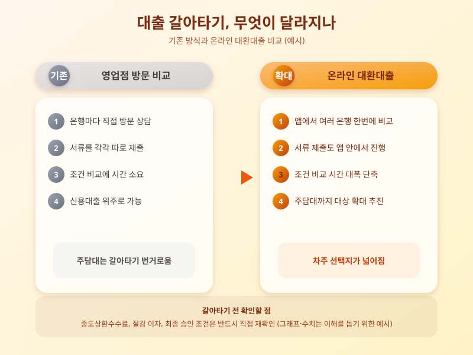

# 온라인 대환대출 인프라 확대, 주담대도 갈아타기 쉬워지나

  

그동안 신용대출과 전세자금대출에 국한됐던 온라인 대환대출 서비스 대상이 주택담보대출로까지 넓어지는 흐름이 뚜렷해지고 있다. 영업점을 방문하지 않고도 스마트폰 앱에서 여러 금융회사의 대출 조건을 비교하고 곧바로 갈아탈 수 있게 되면서, 금리 부담을 줄이려는 차주들의 관심이 커지고 있다.

온라인 대환대출 인프라는 기존 대출을 상환하고 더 유리한 조건의 새 대출로 옮겨가는 과정을 하나의 플랫폼에서 처리하도록 만든 서비스다. 신용대출을 중심으로 시작해 전세자금대출까지 대상이 넓어졌고, 이제는 주택담보대출로도 범위를 확대하려는 움직임이 이어지고 있다. 주담대는 대출 규모가 크고 심사 절차가 복잡해 그동안 온라인 갈아타기가 더뎠지만, 비교·신청 절차를 간소화하려는 시도가 계속되며 실제 이용 문턱이 낮아지는 분위기다.

  

이런 흐름이 주목받는 이유는 명확하다. 대출을 받은 뒤에도 시장 금리와 은행별 우대 조건은 계속 바뀌는데, 기존에는 갈아타려면 여러 은행 창구를 일일이 방문해 서류를 준비해야 했다. 온라인 대환대출은 이 과정을 단순화해 더 많은 차주가 손쉽게 조건을 비교하고 유리한 상품으로 옮겨갈 수 있도록 돕는다. 특히 변동금리 주담대를 이용 중이라면 금리 환경 변화에 따라 갈아타기의 실익이 커질 수 있어 관심을 가질 만하다.

다만 결정 전에 따져볼 점도 있다. 기존 대출의 중도상환수수료가 얼마나 부과되는지, 새 대출로 옮겼을 때 절감되는 이자가 수수료보다 큰지, 갈아탈 상품의 한도와 상환 조건이 본인 상황에 맞는지를 꼼꼼히 비교해야 한다. 또한 플랫폼이 제시하는 조건이 실제 승인 시점의 최종 조건과 다를 수 있으므로, 신청 전 해당 금융회사에 직접 재확인하는 절차도 필요하다. 온라인 대환대출 인프라가 확대될수록 선택지는 늘어나지만, 그만큼 꼼꼼한 비교가 이득으로 이어진다는 점을 기억해두면 좋겠다.

※ 이 초안은 AI가 생성했습니다. 게시 전 수치·정책 내용의 사실관계를 반드시 확인하세요.
