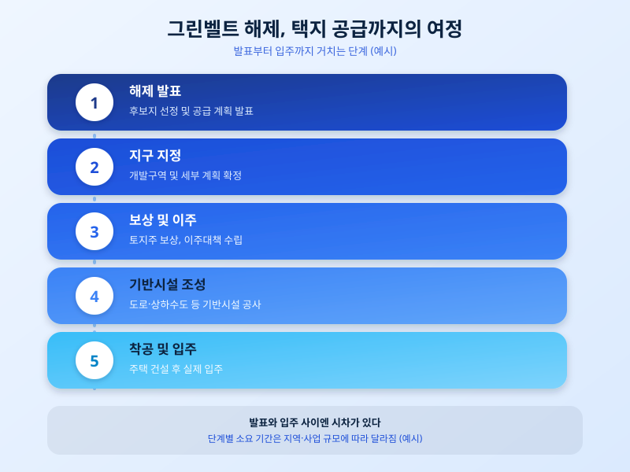

# 그린벨트 해제로 신규 택지 공급 확대, 어디가 달라질까

  

주택 공급 부족 우려가 커지면서 정부가 개발제한구역, 이른바 그린벨트를 해제해 신규 택지를 공급하는 방안을 다시 꺼내 들었다. 도심 인근에 새 주거지를 마련해 공급 물량을 늘리겠다는 취지인데, 이런 발표가 나올 때마다 해당 지역 주민과 예비 청약자들의 관심이 뜨겁게 쏠린다. 이번 글에서는 그린벨트 해제를 통한 택지 공급 확대가 어떤 배경에서 다시 논의되고 있는지, 그리고 실제로 우리 삶에 어떤 변화를 가져올 수 있는지 짚어본다.

그린벨트는 도시의 무분별한 확산을 막고 자연환경을 보전하기 위해 개발을 제한해 둔 구역이다. 그런데 대도시권을 중심으로 신규 주택 부지가 부족해지면서, 정부는 필요에 따라 일부 지역의 그린벨트를 풀어 택지로 개발하는 방식을 반복적으로 활용해왔다. 이번에도 주택 공급을 늘려 시장을 안정시키려는 목적으로, 입지 여건이 좋은 지역을 중심으로 해제 대상을 검토하는 흐름이 이어지고 있다.

  

다만 그린벨트를 해제한다고 해서 곧바로 새 집이 생기는 것은 아니다. 후보지 선정과 해제 발표 이후에도 지구 지정, 보상과 이주대책 수립, 도로·상하수도 같은 기반시설 조성을 거쳐야 비로소 착공과 입주로 이어진다. 이 과정에는 상당한 시간이 걸리기 때문에 발표 시점과 실제 공급 시점 사이에는 큰 간극이 생긴다. 또한 해제가 유력하다는 소식만으로 인근 부동산 가격이 먼저 움직이는 경우도 있어, 정보를 접할 때는 확정된 계획인지 아직 검토 단계인지부터 구분해서 볼 필요가 있다.

무주택자나 실수요자 입장에서는 이런 공급 대책을 장기적인 선택지로 받아들이는 편이 현실적이다. 당장 몇 년 안에 입주할 수 있는 물량인지, 청약 자격 요건은 어떻게 되는지, 교통이나 생활 인프라는 언제쯤 갖춰지는지를 꼼꼼히 확인한 뒤 자신의 자금 계획과 맞춰보는 태도가 필요하다. 공급 확대 소식 자체보다, 그 소식이 자신의 내 집 마련 시점과 어떻게 맞물리는지를 따져보는 것이 더 중요하다.

※ 이 초안은 AI가 생성했습니다. 게시 전 수치·정책 내용의 사실관계를 반드시 확인하세요.
