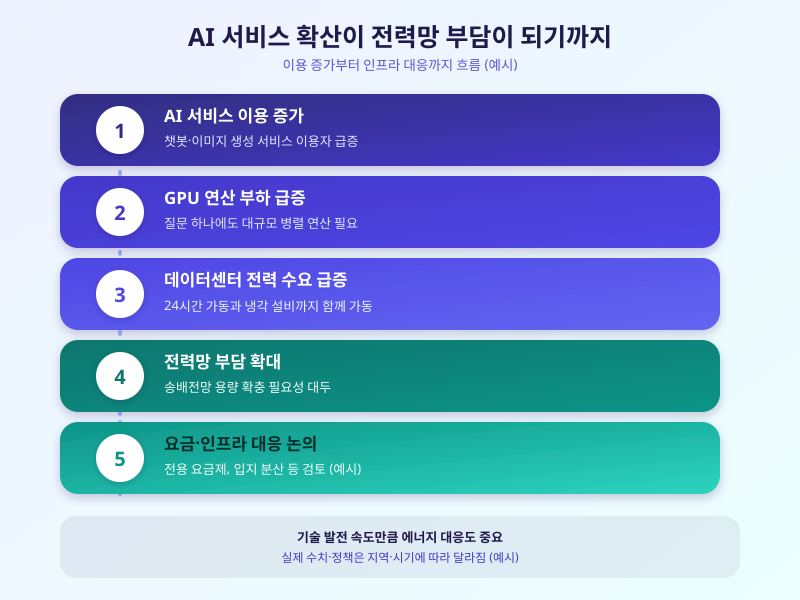

# AI 데이터센터 전력 수요 급증, 국내 전력망은 감당할 수 있을까

  

지금 인터넷에서 접하는 챗봇, 이미지 생성, 검색 요약 같은 AI 서비스는 화면 뒤에서 대규모 데이터센터가 쉬지 않고 연산을 돌린 결과물이다. 최근 AI 서비스 이용이 폭발적으로 늘면서 이를 뒷받침하는 데이터센터의 전력 소비량도 빠르게 증가하고 있고, 그 여파가 국내 전력망 부담과 전기요금 논쟁으로까지 번지는 모습이다. 이번 글에서는 AI 데이터센터가 왜 이렇게 많은 전력을 필요로 하는지, 그리고 이 흐름이 우리 생활과 어떤 관계가 있는지 살펴본다.

AI, 특히 생성형 AI 서비스가 전력을 많이 쓰는 이유는 연산 방식 자체에 있다. 이용자의 질문 하나에 답하기 위해서도 수많은 그래픽 연산 장치가 동시에 작동해야 하고, 이런 서버들은 하루 24시간 쉬지 않고 가동되며 발열을 식히기 위한 냉각 설비까지 함께 돌아간다. 기존 일반 데이터센터도 전력을 많이 쓰는 시설이었지만, AI 전용 데이터센터는 이보다 훨씬 밀도 높은 전력을 짧은 시간에 끌어다 써야 하는 구조라 전력망에 주는 부담의 성격 자체가 다르다.

  

이렇게 늘어난 전력 수요는 국내 전력 인프라에도 실질적인 부담으로 이어진다. 대규모 데이터센터가 특정 지역에 몰려 들어서면 해당 지역의 송배전망 용량을 새로 늘려야 하고, 이 과정에서 발생하는 비용 부담을 누가 나눠 질 것인지를 둘러싼 논의도 함께 커지고 있다. 일반 가정과 기업이 쓰는 전기요금에 이런 부담이 전가될 수 있다는 우려가 나오면서, 정부와 전력 당국은 데이터센터 전용 요금제 도입이나 입지 분산 유도 같은 대응 방안을 검토하는 중이다.

결국 AI 기술의 편리함 뒤에는 눈에 보이지 않는 에너지 비용이 자리하고 있는 셈이다. 기업 입장에서는 데이터센터를 지을 때부터 에너지 효율과 지역 전력망 여건을 함께 고려하는 태도가 필요하고, 일반 소비자 입장에서도 AI 서비스 확산이 전기요금이나 지역 인프라 정책에 어떤 영향을 미치는지 관심을 가져볼 만하다. 기술 발전 속도만큼이나 이를 뒷받침할 에너지 인프라 논의도 함께 속도를 낼 필요가 있어 보인다.

※ 이 초안은 AI가 생성했습니다. 게시 전 수치·정책 내용의 사실관계를 반드시 확인하세요.
