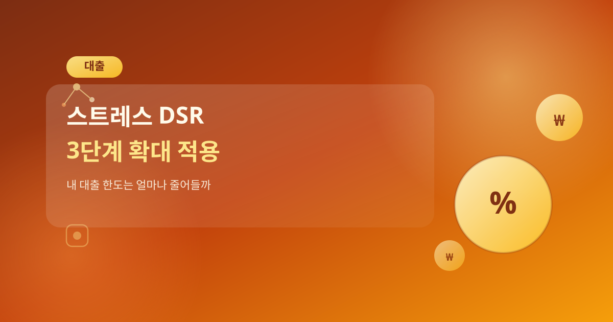
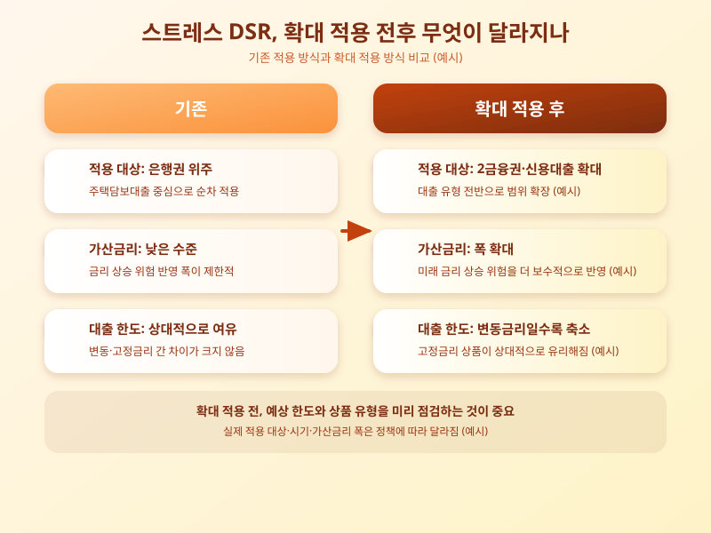

# 스트레스 DSR 3단계 확대 적용, 내 대출 한도는 얼마나 줄어들까

  

최근 대출 관련 뉴스에서 빠지지 않고 등장하는 용어가 바로 '스트레스 DSR'이다. 이미 단계적으로 도입되어 왔지만, 적용 범위를 더 넓히는 방안이 계속 논의되면서 주택 구입이나 대환대출을 앞둔 실수요자들의 관심이 다시 커지고 있다. 대출 한도가 예상보다 줄어들 수 있다는 이야기가 나오는 만큼, 이번 글에서는 스트레스 DSR이 무엇이고 확대 적용 시 무엇이 달라지는지 차근차근 짚어본다.

스트레스 DSR은 변동금리 대출을 받을 때 향후 금리가 오를 가능성까지 미리 반영해, 총부채원리금상환비율(DSR)을 계산할 때 일정한 가산금리를 더해 더 엄격한 기준으로 한도를 산정하는 제도다. 즉 지금 금리가 낮더라도 실제 대출 한도는 미래의 금리 상승 위험까지 감안해 보수적으로 정해지는 셈이다. 이는 가계부채가 금리 변동에 지나치게 취약해지는 것을 막기 위해 도입된 장치로, 그동안 적용 대상과 가산금리 폭을 순차적으로 넓혀오는 방식으로 시행되어 왔다.

  

이번에 논의되는 확대 적용은 그 적용 범위를 은행권뿐 아니라 제2금융권 대출이나 신용대출 등으로 넓히고, 가산금리 폭도 한층 높이는 방향이다. 이렇게 되면 같은 소득이라도 실제로 받을 수 있는 대출 한도가 이전보다 줄어드는 경우가 많아지고, 특히 변동금리 상품을 이용하려던 차주일수록 한도 축소 폭을 크게 체감할 가능성이 높다. 반대로 처음부터 금리 변동 위험이 반영되어 있는 고정금리 상품은 상대적으로 유리하게 평가받는 구조여서, 대출 상품 선택의 기준 자체가 달라질 수 있다.

이런 변화를 앞두고 있다면 실수요자 입장에서는 미리 대응하는 자세가 필요하다. 금융회사 상담이나 모의계산을 통해 확대 적용 이후 예상 한도를 미리 가늠해보고, 변동금리와 고정금리 상품의 총비용을 함께 비교해보는 것이 좋다. 또한 한도가 예상보다 줄어들 가능성을 염두에 두고 자금 계획에 여유를 두는 습관도 중요하다. 결국 스트레스 DSR 확대는 당장의 대출 한도뿐 아니라 앞으로의 상환 능력까지 함께 점검해보라는 신호로 받아들이는 편이 현명해 보인다.

※ 이 초안은 AI가 생성했습니다. 게시 전 수치·정책 내용의 사실관계를 반드시 확인하세요.
