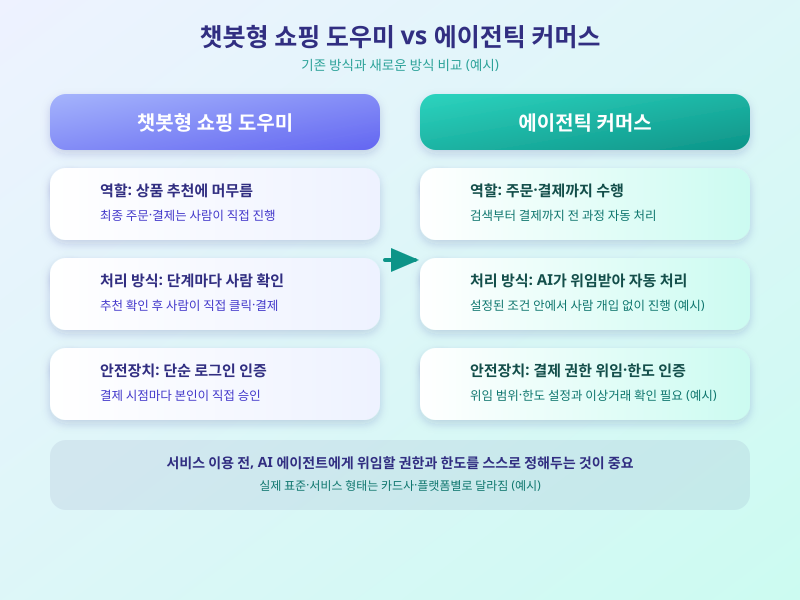

# AI가 대신 결제까지, '에이전틱 커머스' 확산이 몰고 올 변화

  

최근 들어 AI 비서에게 "이 옷 사줘", "이 항공권 예약해줘"처럼 구매 자체를 맡기는 흐름이 빠르게 확산되고 있다. 챗봇이 정보를 찾아주는 데 그치지 않고, 결제 수단과 연동돼 실제 주문과 결제까지 대신 처리하는 이른바 '에이전틱 커머스'가 다음 단계로 떠오르는 중이다. 카드사와 플랫폼 기업들이 관련 표준과 서비스를 잇달아 선보이면서, 소비자 입장에서 무엇이 달라지는지 미리 알아둘 필요가 커지고 있다.

에이전틱 커머스는 AI 에이전트가 사용자의 취향과 예산 조건을 학습해 상품을 비교하고, 카드사와 연동된 결제 프로토콜을 통해 결제까지 자동으로 진행하는 방식을 말한다. 기존 챗봇형 쇼핑 도우미가 상품 추천에 머물렀다면, 에이전틱 커머스는 '검색-비교-주문-결제'라는 여러 단계를 사람의 개입 없이 이어서 처리한다는 점이 다르다. 이를 위해 주요 카드사와 빅테크 기업들은 AI 에이전트가 결제 권한을 안전하게 위임받아 사용할 수 있도록 하는 표준 프로토콜을 마련하는 데 속도를 내고 있다.

  

편리함이 커지는 만큼 우려도 함께 제기된다. AI가 대신 판단해 결제하는 구조에서는 잘못된 주문이나 예산 초과, 원치 않는 구독 결제가 발생했을 때 책임 소재를 어떻게 가릴지가 쟁점이다. 또한 결제 권한을 AI 에이전트에 위임하는 과정에서 개인정보와 결제 정보가 노출될 위험도 배제할 수 없어, 인증 절차와 한도 설정 같은 안전장치가 얼마나 촘촘하게 마련되는지가 서비스 신뢰도를 좌우할 전망이다.

아직은 초기 단계이지만, 에이전틱 커머스는 일상적인 소비 방식 자체를 바꿔놓을 잠재력을 지닌 흐름이다. 소비자 입장에서는 서비스를 도입하기 전, AI 에이전트에게 어떤 권한과 한도까지 위임할 것인지 스스로 기준을 세워두는 태도가 필요해 보인다. 새로운 기술이 주는 편리함을 누리되, 그 이면의 책임과 통제권까지 함께 챙기는 균형 감각이 앞으로 더욱 중요해질 것이다.

※ 이 초안은 AI가 생성했습니다. 게시 전 수치·정책 내용의 사실관계를 반드시 확인하세요.
