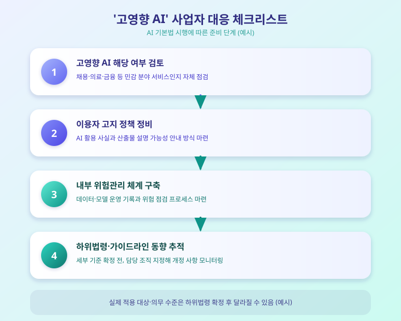

# AI 기본법 시행, '고영향 AI' 사업자가 지금부터 챙겨야 할 것

  

AI 기본법이 시행에 들어가면서, 그동안 원칙 선언에 가까웠던 AI 규제 논의가 실제 기업 대응이 필요한 단계로 넘어가고 있다. 특히 법이 별도로 정의하는 '고영향 AI'에 해당하는 서비스를 운영하는 기업이라면, 막연한 관심을 넘어 지금부터 구체적으로 무엇을 준비해야 하는지 점검할 필요가 커졌다.

AI 기본법은 AI 기술의 발전을 지원하는 동시에, 사람의 생명·안전이나 기본권에 미치는 영향이 큰 영역에서 활용되는 AI를 '고영향 AI'로 규정하고 별도의 의무를 부과하는 구조를 갖고 있다. 채용, 의료, 금융, 공공서비스처럼 개인의 삶에 직접적인 영향을 줄 수 있는 분야의 AI가 대표적인 적용 대상으로 거론된다. 이런 서비스를 운영하는 사업자는 이용자에게 AI가 활용된다는 사실을 고지하고, AI 산출물에 대한 설명 가능성을 확보하며, 위험을 사전에 점검하고 관리하는 체계를 갖추도록 요구받는다.

  

문제는 법의 큰 틀은 마련됐지만, 구체적으로 어떤 서비스가 고영향 AI에 해당하는지, 의무 이행의 수준은 어느 정도여야 하는지를 정하는 하위법령과 가이드라인이 아직 정비되는 중이라는 점이다. 이 때문에 기업 입장에서는 당장 세부 기준이 확정되기를 기다리기보다, 법이 지향하는 방향에 맞춰 내부 대응 체계를 먼저 갖춰두는 편이 안전하다는 목소리가 나온다.

실무적으로는 자사 서비스가 고영향 AI에 해당할 가능성이 있는지 먼저 검토하고, AI 활용 사실을 이용자에게 어떻게 고지할지 정책을 정비하며, 데이터와 모델 운영 전반을 기록·관리할 수 있는 내부 거버넌스 체계를 마련하는 작업부터 시작하는 것이 권장된다. 아울러 하위법령 개정 동향을 주기적으로 확인하는 담당 조직을 지정해두는 것도 도움이 될 수 있다.

AI 기본법은 기업뿐 아니라 서비스를 이용하는 소비자에게도 변화를 가져온다. 앞으로는 어떤 서비스에 AI가 쓰이고 있는지, 그 결과를 어디까지 신뢰할 수 있는지에 대한 고지가 조금씩 눈에 띄게 될 것으로 보인다. 규제가 자리 잡는 과정에서 다소 혼란이 있을 수 있지만, 결국 AI를 더 안전하게 신뢰하고 쓸 수 있는 환경을 만드는 방향으로 나아가는 흐름이라는 점에서 지켜볼 가치가 있다.

※ 이 초안은 AI가 생성했습니다. 게시 전 수치·정책 내용의 사실관계를 반드시 확인하세요.
